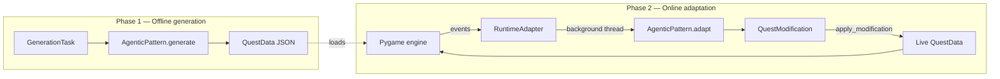
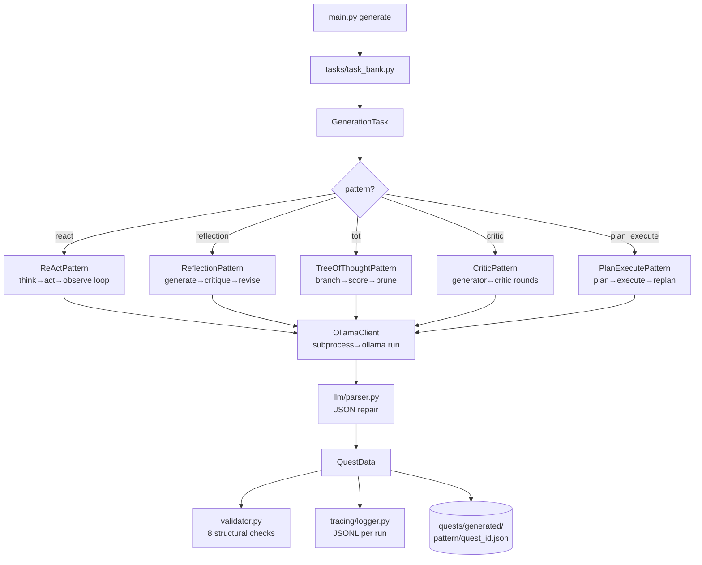
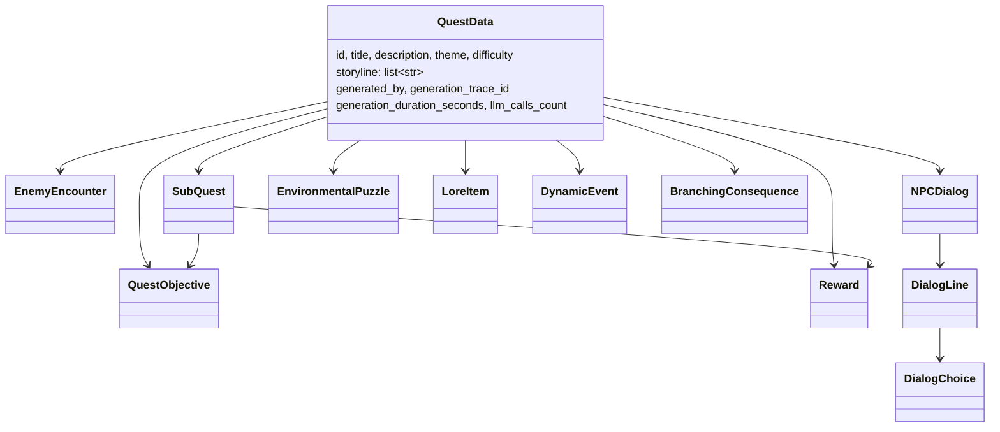
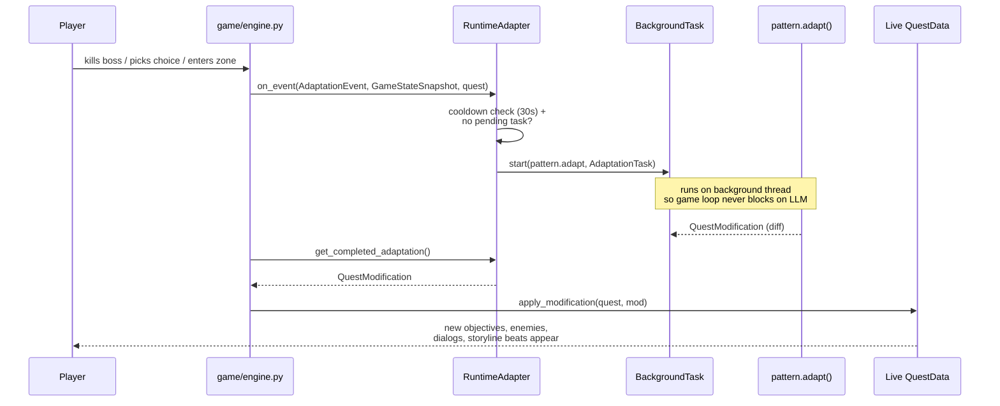
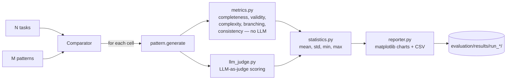

# Agentic Quest Generator

Academic research project comparing five agentic LLM patterns — **ReAct, Reflection, Tree-of-Thought, Critic, and Plan & Execute** — on the task of generating and dynamically adapting structured quests for a Pygame RPG.

All five patterns implement the same interface, produce the same `QuestData` contract, and are scored on the same tasks so their behaviour can be compared head-to-head.

---

## Quick start

Requires Python 3.12+, [Ollama](https://ollama.com/) running locally, and the default model pulled:

```bash
ollama pull phi4:14b
pip install -r requirements.txt

python main.py check-ollama                                 # sanity check
python main.py list-tasks                                   # see task bank
python main.py generate --pattern react --task village_easy # generate one quest
python main.py play --quest quests/generated/react/<id>.json # play it
python main.py evaluate --tasks all --patterns all          # full sweep
```

Defaults live in `config.py` (model name, per-pattern budgets, world zone vocabulary).

---

## Two phases: generation vs runtime adaptation

The project has **two distinct LLM workflows** — this distinction is what the rest of the architecture hangs off.



- **Phase 1** runs once per quest. The pattern performs its full reasoning loop (ReAct steps, Reflection rounds, ToT branching, Critic passes, Plan & Execute steps) and writes a static JSON file.
- **Phase 2** runs continuously while the player is in-game. The engine emits typed events; the adapter wraps them into an `AdaptationTask`; the pattern produces a `QuestModification` diff; the diff is merged into the live quest.

The static JSON is *not* the final product — it's the seed that the runtime layer mutates.

---

## Phase 1 — how generation works

All five patterns share the `AgenticPattern` ABC (`agents/base.py`). Each one takes a `GenerationTask` + `WorldState` and returns a `QuestData`.



Every pattern follows the same recipe:
1. Ask the LLM for each section of the quest in turn (title/description → storyline → objectives → enemies → NPCs → sub-quests → puzzles → lore → dynamic events → branching consequences).
2. Reason over partial state between calls, using the pattern-specific control flow.
3. Emit a validated `QuestData`.

Prompts for each pattern live in `agents/prompts/`. Per-pattern budgets (max steps, rounds, branching width, replans) are in `config.py`.

### The QuestData contract

`quests/schema.py` defines the data every pattern must produce. This is the fixed interface between generation, evaluation, and the game.



All types have explicit `to_dict` / `from_dict` for deterministic JSON round-trip.

---

## Phase 2 — how runtime adaptation works

This is the piece that makes the project dynamic rather than "LLM-generated static JSON + a game that plays it."



Nine event types are emitted from `game/engine.py`: boss defeated, area discovered, branching choice, item acquired, all enemies cleared, NPC killed, reputation threshold, and more (see `runtime/events.py`). Each carries a `GameStateSnapshot` (HP, inventory, position, completed objectives, reputation).

Key rules baked into `runtime/adapter.py`:
- **Never block the Pygame loop on an LLM call.** All adaptation happens on a `BackgroundTask` thread.
- **Never stack adaptations.** One pending at a time; new events during an in-flight adaptation are dropped.
- **30-second cooldown** between adaptations (high-priority events can bypass).
- **Fail silently.** If the pattern crashes or returns malformed JSON, the adaptation is discarded and play continues.

---

## Evaluation

`evaluation/comparator.py` runs the (pattern × task) matrix, writes one `QuestData` per cell, and aggregates:



Structural metrics run without any LLM calls; the LLM judge adds qualitative scoring on top. Output is one directory per sweep under `evaluation/results/run_<timestamp>/`.

---

## Repository layout

```
agents/         # 5 patterns + shared prompts
  base.py           AgenticPattern ABC + GenerationTask/AdaptationTask/WorldState
  react.py          Think-Act-Observe loop
  reflection.py     Generate → critique → revise
  tree_of_thought.py  Branch → score → prune
  critic.py         Generator ↔ critic rounds
  plan_execute.py   Plan → execute → replan
  prompts/          Per-pattern prompt templates

quests/         # The data contract + validation
  schema.py         QuestData and all nested dataclasses
  validator.py      8 structural checks (location refs, dialog tree, etc.)
  generated/        Output of `generate` (per-pattern subfolder)

llm/            # Ollama wrapper + JSON parsing
  client.py         Subprocess-based OllamaClient
  parser.py         JSON repair / extraction

game/           # Pygame client
  engine.py         State machine + event emission
  world.py player.py combat.py dialog_ui.py quest_log_ui.py
  inventory.py hud.py renderer.py npc.py

runtime/        # Bridges game events to pattern.adapt()
  events.py         Typed AdaptationEvent + GameStateSnapshot
  adapter.py        RuntimeAdapter with cooldown + background thread
  threading_utils.py  BackgroundTask helper

evaluation/     # Multi-pattern comparison
  comparator.py metrics.py llm_judge.py statistics.py reporter.py
  results/          Per-run output (charts + CSV + aggregates)

tasks/          # Predefined GenerationTask instances
tracing/        # JSONL per-run prompt/response logs
main.py         # CLI: generate / evaluate / play / list-tasks / check-ollama
config.py       # Frozen global CONFIG (model, budgets, world zones)
```

---

## Current status

**Implemented end-to-end.** ~11,300 lines across all layers. All five patterns, all evaluation machinery, the Pygame client, and the runtime adaptation pipeline are present and wired together.

**Verified in practice:** one ReAct generation on `village_easy` (quest saved, trace recorded, validator passed). That's it.

**Not yet verified:**
- Reflection / ToT / Critic / Plan & Execute have never produced a quest artifact.
- The full evaluation sweep has never been run (`evaluation/results/` is empty).
- Runtime adaptation has never been exercised — no play session has been logged, so the event → adapt() → merge loop is unverified under real LLM output.
- No unit tests.

**Known issues:**
- `OllamaClient.generate` ignores the `temperature` and `max_tokens` arguments (it shells out to `ollama run` rather than using the HTTP API). This means `structured_temperature` vs `default_temperature` has no effect — every call uses the model default. Needs to be swapped for the HTTP API before results are trustworthy.
- Subprocess-per-call is slow. A full ToT run budgets 24 LLM calls; a full evaluation sweep is 5 patterns × all tasks × multi-step reasoning. Expect hours on `phi4:14b` until the HTTP migration happens.
