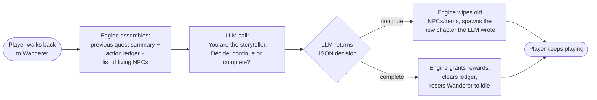
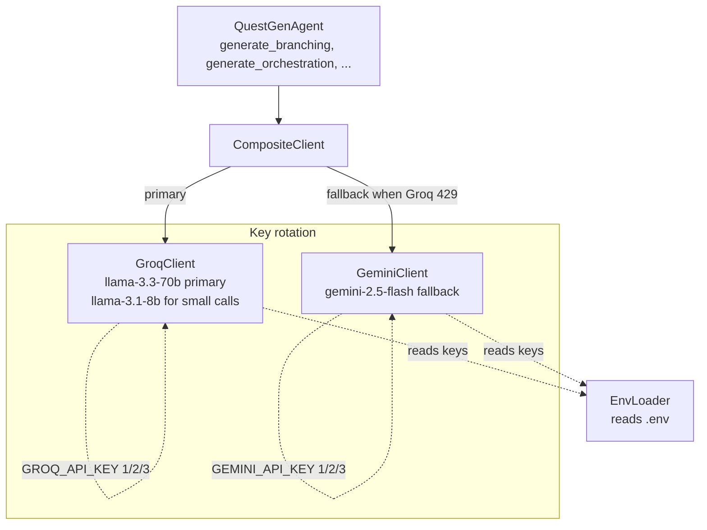
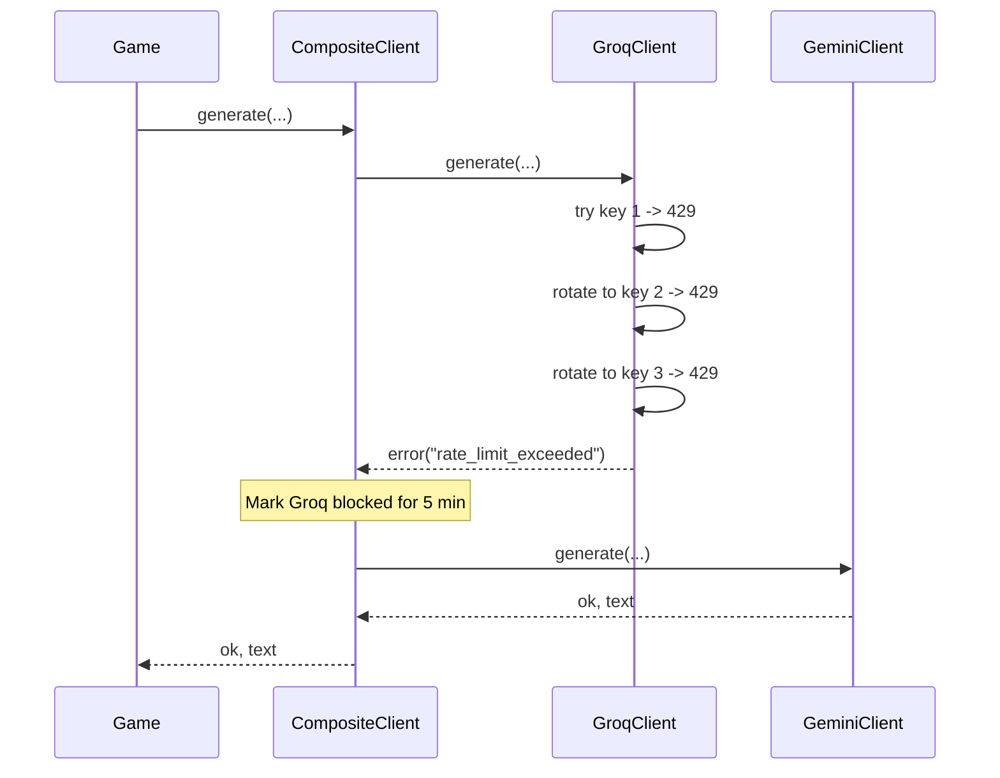
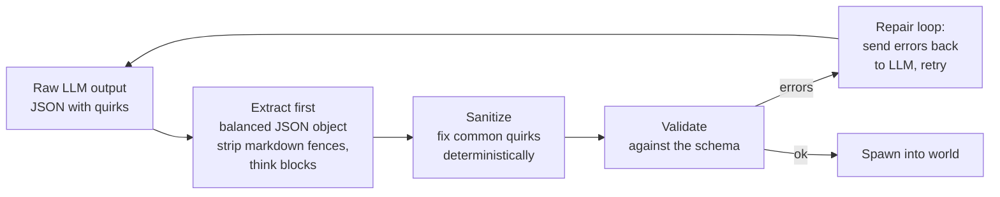
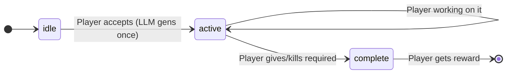
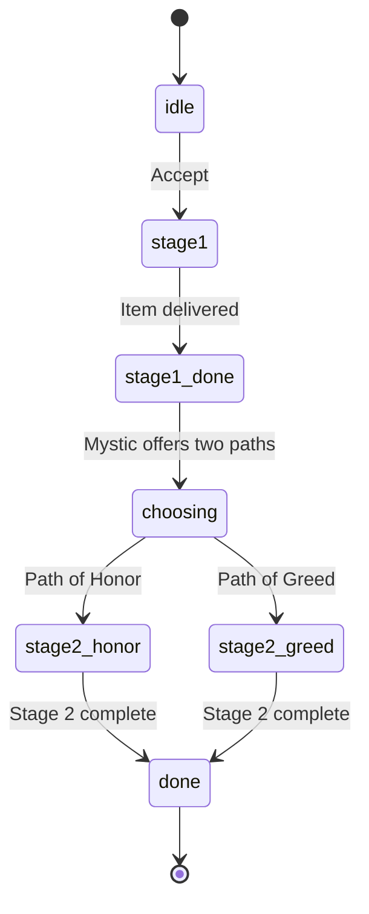
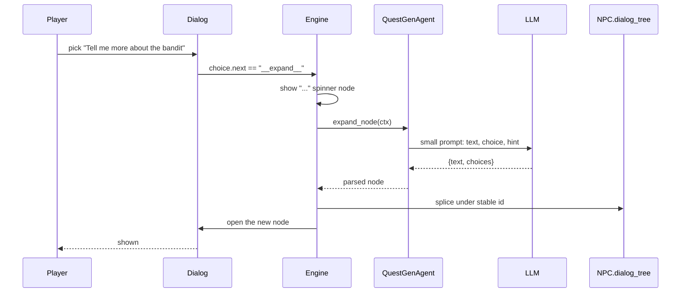
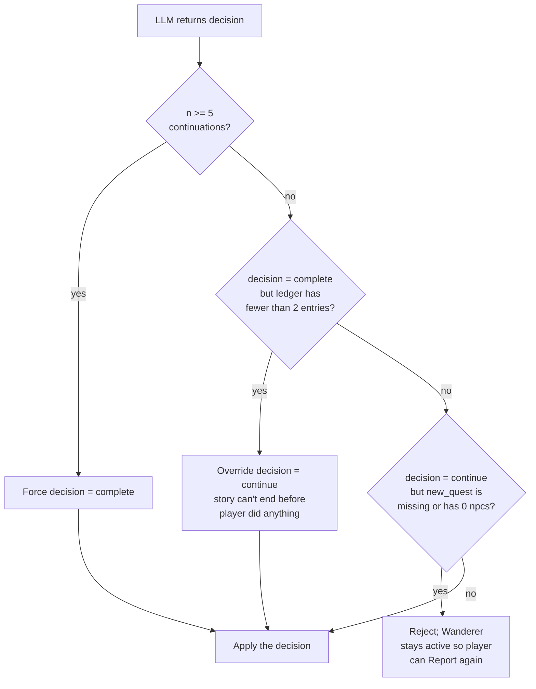
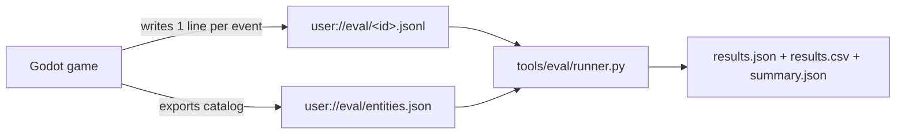

# Agentic Quest Generator

A small top-down adventure game where **the quests aren't written ahead of time** — they're generated and reshaped by a Large Language Model (LLM) while you play.

You walk into a village, talk to a wandering storyteller, and he gives you a quest he just made up. You go act on it: kill someone, give an item to someone, pick a dialog choice. You walk back to the wanderer, and he picks up exactly where you left off — including the things he didn't plan for. Maybe you killed someone he wanted alive. Now that becomes the next chapter. Maybe you stole instead of asking nicely. He weaves that in too. The story bends to fit you, not the other way around.

It's built in **Godot 4.6.2** with **GDScript**, and it can talk to **Groq** (primary, fast LPU inference) or **Google Gemini** (fallback). API keys live in `.env`.

---

## Table of contents

- [The big idea](#the-big-idea)
- [How agentic AI works here](#how-agentic-ai-works-here)
- [System architecture](#system-architecture)
- [The action ledger](#the-action-ledger)
- [Quest schema](#quest-schema)
- [LLM provider stack](#llm-provider-stack)
- [The sanitize → validate → spawn pipeline](#the-sanitize--validate--spawn-pipeline)
- [Other quest-givers](#other-quest-givers)
- [Lazy dialog expansion](#lazy-dialog-expansion)
- [Constraints and guardrails](#constraints-and-guardrails)
- [Evaluation](#evaluation)
- [Running the project](#running-the-project)
- [Project layout](#project-layout)

---

## The big idea

Most games have static quests. Even branching quests are just *several* static quests stitched together — every branch was written ahead of time. Once the writers stop writing, the game stops surprising you.

This project tries something different: there's **one NPC** in the world, the **Wanderer**, who is the storyteller. He has no pre-written quests. When you talk to him for the first time, he calls an LLM and asks it to invent a quest *right now*. The LLM responds with a structured JSON bundle: a quest title, a few NPCs to spawn, items to scatter, branches you can pursue, dialog trees for each NPC.

The engine takes that JSON, brings the new NPCs to life on the map, drops the items, registers the quest, and gets out of the way.

Then you play. Every "story-significant" thing you do — a kill, a give, a take, a key dialog choice — is written down in an internal log called the **action ledger**.

When you walk back to the Wanderer, he reads that ledger. He doesn't check off objectives like a normal RPG quest-giver. Instead he passes the ledger to the LLM and asks: *"the player did all this; should the story keep going, or has it wrapped up? If it should keep going, write the next chapter."*

The LLM either writes a new chapter (we throw away the old NPCs, spawn fresh ones, install the new quest) or a closing epilogue (rewards, victory line, story over).

That's the whole loop. **Walk → Act → Report → New chapter → Repeat**.

---

## How agentic AI works here

The phrase "agentic AI" usually means an AI that can take actions in the world and observe consequences, not just generate text. In this project the **Wanderer is the agent**. The LLM is its brain.

The agent has:

| Agent property | What that means here |
|---|---|
| **A goal** | Tell a satisfying interactive story to the player. |
| **Tools** | A schema for spawning NPCs, items, and quests. The engine executes these for it. |
| **Observations** | The action ledger — what the player has actually done in the world. |
| **Memory** | The full history of decisions across chapters (ledger persists across continuations). |
| **Decisions** | Continue the story (new chapter) or close it (epilogue + rewards). |

Every time you talk to the Wanderer with new entries in the ledger, the agent runs one **planning step**:



The agent doesn't "do" anything itself. It *describes* what should happen — in JSON — and the engine carries it out. That's the contract: the engine implements a small, fixed set of verbs (spawn NPC, spawn item, register quest, set flag, give item, kill NPC) and the agent composes those verbs into stories.

**This is what makes it agentic, not just generative**: the agent observes the world (via the ledger), decides on an action (continue or close, with specific content), and the action is *executed* in the running game. Then it observes again. The loop closes.

The bonus property is **error tolerance**. If the player does something the agent didn't anticipate — kills the wrong NPC, steals when they were supposed to ask, refuses to engage at all — the agent doesn't fail the quest. The next planning step just sees those actions in the ledger and writes them into the new chapter as legitimate plot threads. *"Interesting that you killed the witness. Now the guards are looking for you. The judge wants to talk."*

---

## System architecture

Here's the high-level picture of what talks to what:

```mermaid
flowchart TB
    subgraph Player_World [Player World]
        Player[Player]
        Wanderer[Wanderer NPC<br/>orchestrator]
        Spawned[LLM-spawned NPCs<br/>and items]
        Player -.attacks/talks/gives.-> Spawned
        Player -->|presses E to talk| Wanderer
    end

    subgraph Engine [Engine - Godot]
        QM[QuestManager<br/>- active quests<br/>- action_ledger]
        QS[QuestSpawner<br/>- wipe + spawn<br/>NPCs/items]
        QL[QuestLog UI<br/>Tab key]
        Dialog[DialogBox UI]
    end

    subgraph LLM_Stack [LLM Stack]
        QGA[QuestGenAgent<br/>orchestration entry point]
        Comp[CompositeClient<br/>Groq -> Gemini fallback]
        Sani[QuestSanitizer<br/>fixes LLM quirks]
        Val[QuestValidator<br/>rejects bad output]
    end

    Spawned --kill/give/take/dialog--> QM
    QM --records action--> QM
    Wanderer --on talk--> QGA
    QGA --reads ledger from--> QM
    QGA --calls--> Comp
    Comp --> Sani
    Sani --> Val
    Val --validated bundle--> QGA
    QGA --returns chapter--> QS
    QS --updates--> QM
    QS --spawns--> Spawned
    QM --emits signals--> QL
    Player --interacts with--> Dialog
```

A few things worth calling out:

- **The `QuestManager` is the single source of truth for player actions.** When something story-significant happens (kill, give, take, dialog choice), `QuestManager.record_action()` writes it to the ledger. The Wanderer reads from there.
- **`QuestSpawner.spawn(bundle, ...)` is the only way new NPCs and quests enter the world.** It wipes the previous chapter's content, instantiates the new NPCs from `bundle.npcs[]`, scatters items from `bundle.items[]`, and registers the quest with the manager. Hand-placed NPCs (the Wanderer, Farmer, Hunter, Old Sage, Mystic) are passed in as a "keep" list so the wipe doesn't delete them.
- **Sanitize → Validate is between the LLM and the engine, always.** The model's raw output is never trusted directly. More on this below.

---

## The action ledger

The ledger is a Godot `Array` of dictionaries owned by `QuestManager`. Each entry looks like:

```gdscript
{
  "kind": "kill_npc",       # or "npc_give", "npc_take", "dialog_choice"
  "params": { "npc_name": "Silas" },
  "frame": 28805            # Engine frame counter, for ordering
}
```

It's capped at 20 entries to keep prompts bounded. The kinds we record:

| Kind | When it fires | What's in `params` |
|---|---|---|
| `kill_npc` | Player kills any LLM-spawned NPC | `npc_name` |
| `npc_give` | Player hands an item to an NPC via the Give action | `npc_name`, `item_id` |
| `npc_take` | Player takes an item from an NPC's inventory | `npc_name`, `item_id` |
| `dialog_choice` | Player picks a dialog choice | `npc_name`, `choice_id` |

Hooks live in `QuestManager._on_npc_killed`, `_on_npc_interacted`, and the public `dialog_choice` method. Every existing path that fired a `_dispatch` for a story-relevant event got a `record_action` line added next to it.

The ledger **persists across continuations**. Chapter 3's prompt sees actions from chapters 1 and 2. The Wanderer can reference them to make the world feel like it remembers. The ledger is cleared only when the agent decides `complete`.

Here's the key insight: **a tracked action that the LLM didn't anticipate is not an error**. The first chapter might say "talk to the witness", and you might kill the witness instead. That kill goes into the ledger. The next time the Wanderer runs, the LLM sees `killed witness` in the ledger and is instructed (via prompt) to treat it as a creative seed — *not* to fail the quest. So the next chapter might be "the witness is dead, the guards are investigating, here's a coverup quest", or "the witness is dead, your reputation has soured, here's an act of redemption". The story bends.

---

## Quest schema

When the LLM emits a chapter, it returns one big JSON object the engine calls a **bundle**:

```jsonc
{
  "quest": {
    "id": "shadow_deal",
    "title": "The Shadow Deal",
    "description": "...",
    "branches": [
      {
        "id": "branch_kill_dealer",
        "description": "Eliminate Silas.",
        "requires_flags": { "flag:talked_to_silas": "true" },
        "objectives": [
          { "type": "kill_npc", "params": {"npc_name":"Silas"}, "required": 1 },
          { "type": "talk",     "params": {"npc_name":"Wanderer"}, "required": 1 }
        ],
        "rewards": [{ "item_id": "coin_gold", "count": 10 }]
      }
    ],
    "fail_conditions": [],            // optional, ignored for orchestrator-managed quests
    "orchestrator_managed": true      // if true, evaluate() is short-circuited
  },
  "npcs": [
    {
      "npc_name": "Silas",
      "character_sheet": "Monk",      // closed catalog of sprite folders
      "role": "shady_dealer",
      "position_hint": "sw",          // resolves to a world coord around the player
      "max_health": 3,
      "initial_items": [{"id":"coin_gold","count":5}],
      "dialog_start": "start",
      "start_nodes": [
        { "node": "start_post_meet", "requires": { "flag:met_silas": "true" } },
        { "node": "start", "requires": {} }
      ],
      "dialog_tree": {
        "start": {
          "text": "Silas turns. 'You are late.'",
          "choices": [
            { "id": "ask_about_deal", "text": "What deal?",
              "actions": ["set_flag:met_silas=true"], "next": "deal_details" }
          ]
        },
        "deal_details": { ... },
        "start_post_meet": { ... }
      }
    }
  ],
  "items": [
    { "id": "gem_red", "position_hint": "near_player" }
  ]
}
```

The schema is intentionally small. There are five ways for a player to interact with the world (talk, give, take, kill, dialog choice), and the schema encodes exactly those. If the LLM tries to invent something else — "investigate the windmill", "follow the hooded figure" — it gets rejected or sanitized.

The crucial fields:

- **`branches[]`** are the alternative paths through the quest. Each has `requires_flags` (a predicate that must match for this branch to be reachable) and `objectives` (the steps to complete it).
- **`actions`** in dialog choices are tiny commands the engine executes: `set_flag:k=v`, `give_player:item_id`, `take_player:item_id`, `remember:k=v` (per-NPC scratchpad), `drop_inventory`, `die`.
- **`requires` / `requires_flags`** use a small predicate DSL: `flag:KEY = "value"`, `quest:ID = "completed"`, `inv:item_id = ">=2"`, `memory:NPCNAME.fieldname = "value"`.
- **`start_nodes`** are checked top-to-bottom on every conversation start; the first one whose `requires` passes wins. This is how an NPC says different things on a second meeting versus a first.
- **`orchestrator_managed: true`** disables the engine's auto-completion logic. Without this flag, when all of a branch's objectives are met, the quest auto-closes. With this flag set (which the orchestrator path always sets), the engine treats the quest as `active` no matter what — only the Wanderer's next LLM call can close it.

---

## LLM provider stack

The game can talk to multiple LLM providers. They're stacked behind a single interface so the higher-level code doesn't care which one is up.



**Why a stack?**

- **Free tiers throttle.** Groq's free tier limits tokens per minute *and* per day. A single user's Wanderer can blow through that in one play session. Multiple keys per provider, plus a second provider, keeps the game playable.
- **Different providers have different strengths.** Groq's LPU is dramatically faster (~1-3s for a chapter vs 10-30s for Gemini), but its free tier is tighter.
- **The interface is identical**: every client exposes `generate(model, system, user, options, format) -> {ok, text, error}`. Nothing above the client layer cares which provider answered.

**How rotation works**:

- `EnvLoader.get_keys_with_prefix("GROQ_API_KEY")` returns `[GROQ_API_KEY, GROQ_API_KEY2, GROQ_API_KEY3]` (whichever exist).
- `GroqClient` rotates through them on 429s. No waiting between rotations — TPM is per-key.
- If all keys 429, the client returns the error fast (no `Retry-After` waiting — that's the next layer's job).
- `CompositeClient` catches the failure, sees "rate limit / 429 / tokens per day" in the error string, and falls through to Gemini for the next 5 minutes.
- After 5 minutes Groq is tried first again, in case the daily window reset.



---

## The sanitize → validate → spawn pipeline

LLMs are wonderful at writing dialog and terrible at following strict schemas. Every response from the model goes through three stages before the engine touches it.



**Stage 1: extraction.** `QuestGenAgent._extract_first_json` walks the text character-by-character, ignoring everything outside the first balanced `{...}`. Strips `<think>...</think>` blocks (some models emit reasoning prefaces), and `\`\`\`json` markdown fences. Even if the model dumps prose before the JSON, this picks it up.

**Stage 2: sanitize.** `QuestSanitizer.sanitize(bundle, drop_npc_names)` runs **fixes that are too common to ask the model to handle**:

- **Drop NPCs the model duplicated.** If the model emits a "Wanderer" NPC even though the world already has one, drop it (the `drop_npc_names` arg lists hand-placed givers).
- **Snap `character_sheet` to a real one.** Model wrote `"Thug"`? We don't have that sprite folder. Map by role keyword: bandit/thug → Hunter, elder/sage → OldMan, etc.; fall back to Levenshtein distance.
- **Strip non-ASCII from IDs.** Some models emit `"band端_bribe"`. We strip to lowercase a-z + digits + `-_`.
- **Fix action verb whitespace.** `"give_ player:gem"` → `"give_player:gem"`.
- **Convert wrong verbs.** `"memory:k=v"` (predicate prefix used as action) → `"remember:k=v"`. `"kill_npc:X"` (objective type used as action) → bare `"die"`.
- **Fix predicate keys.** `"memory:Elara:knows_x"` → `"memory:Elara.knows_x"` (colon → dot for memory keys).
- **Drop objectives referencing unknown NPCs.** Model says "talk to villager" but no NPC named villager exists → drop the objective rather than fail validation.
- **Case-fix `wanderer` → `Wanderer`.** Lowercase emissions get matched case-insensitively to the canonical name.
- **Drop unknown items from `initial_items`.** Model invented `"dagger"`? Catalog doesn't have it; drop.
- **Auto-inject `met_<npc>` flags.** If the model didn't gate any `start_node` on a flag, sanitize injects a `set_flag:met_X=true` on the first dialog choice and prepends a `start_remember` node so re-visits don't replay the intro.
- **Auto-inject "report back" objective.** Single-objective branches feel anticlimactic (kill X, done!). Sanitize appends a `talk:<quest_giver>` so the player has to return to wrap.
- **Strip `die` from dialog choices on protected NPCs.** If the model writes a choice that kills an NPC who's a target of a give/talk objective, that softlocks the quest. Strip the action.
- **Drop fail_conditions that overlap branch objectives.** A common LLM contradiction: branch says "kill Silas", fail says "Silas died". Killing Silas advances 1/3 of the branch *and* triggers the fail. Drop the fail.
- **Auto-inject "Tell me more" choice on empty-choices nodes.** Empty `choices: []` becomes a single `__expand__` choice so dialog can keep going.

The sanitizer is **load-bearing**. Without it, ~half of LLM responses fail validation. With it, ~95% pass on the first attempt.

**Stage 3: validate.** `QuestValidator.validate(bundle, extra_known_npcs)` checks the bundle against the schema rules. Returns an `Array[String]` of human-readable errors. Notable rules:

- Every `npc_name` referenced anywhere must be in `bundle.npcs[]` *or* in `extra_known_npcs` (which lets objectives reference the hand-placed Wanderer).
- Every `item_id` must be in the catalog (`ItemDB.all_ids()`).
- Every `character_sheet` must be a real folder under `assets/characters/`.
- Every `position_hint` must be one of the closed compass set (`nw, ne, sw, se, n, s, e, w, center, near_player`).
- Branch ids unique. Each branch has ≥1 objective and ≥1 reward (sanitizer auto-fills if missing).
- Predicate prefixes valid (`flag`, `quest`, `inv`, `memory`).
- Action verbs valid.
- Dialog `next` references must point at a real node id (or `"end"` or `"__expand__"`).

**Stage 4: repair loop.** If validation fails, the agent sends the errors back to the LLM with a "your previous output had these errors, fix only those, re-emit the full JSON" prompt. Up to `MAX_REPAIRS = 6` attempts. In practice this is rarely needed once the sanitizer has run.

**If repair fails MAX_REPAIRS times**, the agent falls back to a known-good fixture (the hand-authored `tests/fixtures/heirloom_quest.json`) so the player isn't stuck with no quest.

---

## Other quest-givers

The Wanderer is the orchestrator, but four other hand-placed NPCs provide simpler experiences for showing off different LLM patterns. All five live in `main._spawn_quest_givers`:

| NPC | Sprite | Position | Pattern |
|---|---|---|---|
| **Wanderer** | Monk | (-288, -120) NW | Full orchestrator (described above) |
| **Farmer** | Villager | (0, 0) | Simple `give:item` quest |
| **Hunter** | Hunter | (-80, -128) | Simple `kill_enemy` quest |
| **Old Sage** | OldMan | (128, 32) | Simple `give:item` quest |
| **Mystic** | Princess | (-32, 96) | Two-stage moral-choice quest |

**Simple-quest pattern (Farmer, Hunter, Old Sage):**

A single LLM call produces one objective, dialog snippets for the three states (intro, in-progress, complete), and a reward. Fast — uses `llama-3.1-8b-instant` because the schema is tiny:



**Mystic two-stage pattern:**

Two LLM calls. The first generates a fetch quest framed as a setup (*"bring me the herb, but you'll have to choose what to do with it"*). When the player turns in the item, the Mystic offers two buttons: **`Path of Honor`** or **`Path of Greed`**. The choice is fed back to a second LLM call as `path_hint`, which generates stage-2 objectives that fit the choice (*"a heroic kill if honor, a quiet errand if greed"*).

This is a smaller, controlled example of the orchestrator pattern: the player's choice changes what the second call generates, but the choice is an explicit button rather than a ledger of in-world actions.



These simpler patterns exist because they each show off a different way to use the LLM: one-shot generation (simple), branched-by-button (Mystic), branched-by-action-ledger (Wanderer).

---

## Lazy dialog expansion

LLMs cost tokens. A full bundle with deeply-nested dialog trees for 4 NPCs would be a huge prompt. The system avoids that by emitting **shallow** dialog trees — depth 2 from each `start_*` node — with deeper choices marked `next: "__expand__"`.

When the player picks an `__expand__` choice, the engine fires *one* more LLM call with the parent node's text + the choice the player took as context, and asks for a single dialog node `{text, choices}`. That node gets spliced into the NPC's `dialog_tree` under a stable id, so revisits skip expansion.



The expansion uses the **fast model** (`llama-3.1-8b-instant`) because it's a tiny prompt (~500 tokens) and the player is staring at a spinner. Failures fall back to a `"Tell me more"` injected choice so the conversation never dead-ends.

This means the *initial* bundle generation is cheap (only depth-2 dialog), but the world feels arbitrarily deep — the LLM fills in detail on demand as the player explores.

---

## Constraints and guardrails

The hardest part of building this wasn't the LLM call — it was getting the LLM to **stay inside the game's mechanics**. By default, models will write things like:

- *"Meet me at the old windmill at midnight."* (no windmills, no time of day)
- *"Investigate the abandoned mine."* (no mines)
- *"Ask the villager to follow you."* (NPCs don't move)
- *"Bring me a magic dagger."* (`dagger` not in catalog)

The system pushes back at three layers:

**Prompt layer.** The branching prompt has an explicit FORBIDDEN block at the top *and* the bottom (LLMs over-weight first and last instructions):

> ❌ "Find me at the old mine."
> ✅ "Talk to the Wanderer — he knows what to do next."
>
> ❌ "Meet me at midnight."
> ✅ "Bring back the gem and the Wanderer will explain."

Plus a final scan-instruction: *"Before emitting JSON, scan every `choice.text` and `node.text`. If any contains windmill/mine/midnight/follow/lead-me-to → rewrite."*

**Sanitizer layer.** Anything the prompt doesn't catch but is mechanical (unknown items, wrong action verbs, casing) gets fixed deterministically.

**Engine layer.** Bundles that still have schema violations after sanitize fail validation, kick into the repair loop, and if all retries fail, fall back to the fixture quest so the player isn't blocked.

**Hard guardrails on the orchestrator** (in `main._orchestrate_next_chapter`):



Five continuations max per quest. Empty new chapters get rejected (the most common LLM regression).

---

## Evaluation

The project ships with a fully-automated evaluation harness. It computes five paper-style metrics over batches of headless game sessions where a **scripted player** drives the world end-to-end — no human input, no gameplay required. Everything lives under `tools/eval/`.

### What it measures



| # | Metric | What it answers |
|---|---|---|
| 1 | **Structural Adherence** | Does the LLM output parse and pass schema validation? |
| 2 | **Accuracy of Given Strings** | Are NPC names, item ids, character sheets, and position hints all real (in the closed catalog)? |
| 3 | **Adaptation Rate** | How many continuation chapters the orchestrator fires per hour of play. |
| 4 | **Memory Consistency** | When the Wanderer references past actions, are they actually in the action ledger? |
| 5 | **Replanning Latency** | Wall-clock ms from `[Report]` click to a usable new chapter. |

Memory consistency uses **structured claims** ("Option A"): the orchestration prompt asks the LLM to optionally emit `memory_claims: [{kind, params}]` alongside its dialog. The engine deterministically subset-matches each claim against the action ledger and tags it `verified: true|false`.

### Scripted player profiles

Four deterministic state machines drive the player. They emit dialog signals directly (`dialog.action_chosen.emit("Yes")`) and call `Player.scripted_set_velocity / scripted_attack / scripted_interact` — no fake input events. A stuck-detector with perpendicular sidesteps (~0.8s commit) handles the village walls.

| Profile | Behaviour |
|---|---|
| `aggressive` | Walks to nearest LLM-spawned NPC, attacks until dead. Reports back. Repeats. |
| `cautious` | Talks to each LLM NPC once (first non-`end` choice), never attacks, then reports. |
| `explorer` | Cycles `talk → give → kill` across distinct NPCs, reports between cycles. |
| `completionist` | Talks to every NPC twice, gives one item, kills the villain-role NPC, reports. |

Sessions end when the profile's chapter cap is hit, or after a 5-min hard wall-clock cap, or 30s of no progress (stuck), or whenever the orchestrator decides to close the quest.

### How to run

```bash
# Smoke test — 8 sessions (~5-15 min)
N=2 bash tools/eval/run_all.sh

# Full run — 60 sessions (4 profiles × 15)
bash tools/eval/run_all.sh
```

PowerShell equivalent: `.\tools\eval\run_all.ps1`. Outputs land in `tools/eval/results/{results.json, results.csv, summary.json}` and raw event streams in `tools/eval/sessions/`. Re-aggregate without re-playing via `python tools/eval/runner.py --in tools/eval/sessions --out tools/eval/results --entities tools/eval/entities.json`.

### Sample results (smoke run, N=1 across all four profiles)

These are the numbers from a small initial run — useful as ground-truth that the harness works, not as a paper-ready dataset. Across **7 sessions** (some early ones aborted before reaching the Wanderer; later ones reached him after the stuck-detector fix):

| Metric | Value | Notes |
|---|---|---|
| **Structural pass rate** | **1.00** | Every quest that survived parsing also passed full schema validation. |
| **Parse rate** | 1.00 | No malformed JSON ever escaped the brace-counting extractor. |
| **Avg generation attempts** | 1.5 | Most bundles validate first try; sanitizer + repair loop handles the rest. |
| **Avg sanitizer fixes / bundle** | ~12 | Casing, ASCII-cleaning, NPC duplicates, etc. Load-bearing — without these, validation rate drops to ~0. |
| **String accuracy** | **1.00** | Across post-sanitize bundles, every NPC / item / sheet / position-hint reference resolves. |
| **Replanning latency (median)** | **4.5 s** | One sample. Groq's LPU keeps it tight. |
| **Replanning latency (p95)** | 22.9 s | Long tail dominated by occasional repair-loop retries. |
| **Adaptation rate** | 0 / hr | No continuations completed in the smoke run — sessions were too short. The instrumentation is wired (the `replan_triggered` / `replan_completed` signals fire), but to populate this metric we need longer runs. |
| **Memory consistency** | n/a | The 70b model didn't emit any `memory_claims` in this small run. The prompt instruction is in place; expect non-trivial counts once continuations land. |

Full per-session breakdown lives in `tools/eval/results/results.csv`. The aggregator skips `null` cells (sessions that ended before producing the relevant metric), so each metric's `n` reports how many sessions actually contributed.

### Reading the event stream

Every session produces one `.jsonl` file in `user://eval/`. Each line is a single event:

```json
{"agent":"QuestGenAgent","event_type":"quest_generated","payload":{"phase":"branching","parsed_ok":true,"schema_valid":true,"sanitizer_fix_count":13,"attempt":1,"quest_id":"the_missing_gem","npc_count":4,"branch_count":4,"model":"llama-3.3-70b-versatile","elapsed_ms":14469,"raw_text_len":11592},"session_id":"20260428_011546_aggressive","timestamp_ms":23978}
```

Event types emitted: `session_start`, `quest_generated`, `quest_revised`, `replan_triggered`, `replan_completed`, `player_action`, `memory_claim`, `orchestration_complete`, `orchestration_failed`, `session_end`. Schemas live in `scripts/evaluation_logger.gd` callsites; the runner reads them with permissive `.get(key, default)` so adding new payload fields doesn't break old sessions.

## Running the project

You need:

- **Godot 4.6.2** (any platform; this repo's command examples use the Windows binary).
- **Either a Groq API key or a Gemini API key** (free tiers work fine; both is recommended for fallback).

Create a `.env` file in the project root:

```env
GROQ_API_KEY=gsk_...
GROQ_API_KEY2=gsk_...           # optional, rotation pool
GROQ_API_KEY3=gsk_...           # optional, rotation pool
GEMINI_API_KEY=AIza...
GEMINI_API_KEY2=AIza...         # optional
GEMINI_API_KEY3=AIza...         # optional
```

Then open the project in Godot and run `scenes/Main.tscn`, **or** from the command line:

```bash
# Visible run
"<godot>/Godot_v4.6.2-stable_win64.exe" --path .

# Headless parse-check
"<godot>/Godot_v4.6.2-stable_win64_console.exe" --headless --path . --quit-after 2

# Reimport (needed after adding new .gd files with class_name)
"<godot>/Godot_v4.6.2-stable_win64_console.exe" --headless --path . --import

# Test scenes
"<godot>/Godot_v4.6.2-stable_win64_console.exe" --headless --path . res://scenes/Test.tscn         # unit tests
"<godot>/Godot_v4.6.2-stable_win64_console.exe" --headless --path . res://scenes/TestPlay.tscn     # playthrough DSL
"<godot>/Godot_v4.6.2-stable_win64_console.exe" --headless --path . res://scenes/TestLLM.tscn      # validator + spawner against fixture
"<godot>/Godot_v4.6.2-stable_win64_console.exe" --headless --path . res://scenes/TestSanitizer.tscn  # offline sanitize+validate against a dump
```

Once running:

- **WASD** to move
- **E** to interact with NPCs / pick up items
- **Space / J** to attack
- **Tab** to open the quest log
- **1–9** to select hotbar slots
- **Q** to drop the selected item

Walk to the Wanderer (north-west, behind the trees), press E, accept his tale.

---

## Project layout

```
Agentic-Quest-Generator/
├── scripts/
│   ├── main.gd                  # game root: spawns world, wires Wanderer state machine
│   ├── camera_grid.gd           # room-by-room camera (port of NinjaAdventure ref)
│   ├── dialog.gd, hud.gd        # UI
│   ├── inventory.gd, item_*.gd  # item system
│   ├── npc.gd, enemy.gd, player.gd, hitbox.gd, hurtbox.gd  # entities + combat
│   ├── quest.gd                 # Quest, Branch, Status enum
│   ├── quest_manager.gd         # autoload: active_quests, action_ledger
│   ├── quest_log.gd             # Tab UI
│   ├── quest_spawner.gd         # wipe + spawn for a bundle
│   ├── game.gd                  # autoload: signal hub
│   ├── item_db.gd               # autoload: closed catalog
│   └── llm/
│       ├── prompts.gd            # all system + user prompt builders
│       ├── quest_gen_agent.gd    # the agent: generate_branching, generate_orchestration, ...
│       ├── quest_sanitizer.gd    # deterministic fixes
│       ├── quest_validator.gd    # schema validation
│       ├── world_catalog.gd      # what items / sheets / hints exist
│       ├── env_loader.gd         # .env reader with key-prefix discovery
│       ├── composite_client.gd   # Groq -> Gemini fallback
│       ├── groq_client.gd
│       ├── gemini_client.gd
│       └── ollama_client.gd      # legacy local provider, unused
├── scenes/
│   ├── Main.tscn                # game entry
│   ├── Test.tscn                # unit tests
│   ├── TestPlay.tscn            # scripted playthroughs
│   ├── TestLLM.tscn             # validator + spawner against fixtures
│   └── TestSanitizer.tscn       # offline sanitize+validate iteration
├── content/map/                 # imported NinjaAdventure village (CC0)
├── assets/                      # sprites, tilesets
├── tests/fixtures/              # heirloom_quest.json fallback bundle
├── CLAUDE.md                    # guidance for AI assistants editing this repo
└── README.md                    # this file
```

Three Godot **autoloads** are configured in `project.godot`:

- `ItemDB` — closed-set item catalog (`ItemDB.has(id)`, `ItemDB.weapon_stats(id)`).
- `Game` — signal hub (`npc_killed`, `npc_interacted`, `item_picked_up`, etc.) plus `Game.log_event(tag, data)`.
- `QuestManager` — active/completed quest state, the action ledger, signal-driven event dispatch.

Everything else is referenced by `class_name` (Godot's static class registry) — `QuestGenAgent`, `CompositeClient`, `QuestSanitizer`, etc.

---

## Credits

- **Sprites + tilesets:** [Ninja Adventure asset pack](https://pixel-boy.itch.io/ninja-adventure-asset-pack) by Pixel-Boy and AAA — CC0.
- **Engine:** Godot 4.6.2.
- **LLM providers:** Groq and Google Gemini.

The world's *map data* (`content/map/map_village.tscn`, `tileset.tres`, the 5 atlas PNGs) is imported as-is from the NinjaAdventure reference Godot project, with character/teleporter/environment nodes stripped — only the tilemap remains. Everything else is original to this project.
