# Agentic Quest Generator

A small top-down adventure game where **the quests aren't written ahead of time** — they're generated and reshaped by a Large Language Model (LLM) while you play.

You walk into a village, talk to a wandering storyteller, and he gives you a quest he just made up. You go act on it: kill someone, give an item to someone, pick a dialog choice. You walk back to the wanderer, and he picks up exactly where you left off — including the things he didn't plan for. Maybe you killed someone he wanted alive. Now that becomes the next chapter. Maybe you stole instead of asking nicely. He weaves that in too. The story bends to fit you, not the other way around.

It's built in **Godot 4.6.2** with **GDScript**, and it can talk to **Groq** (primary, fast LPU inference) or **Google Gemini** (fallback). API keys live in `.env`.

---

## Table of contents

- [The big idea](#the-big-idea)
- [How agentic AI works here](#how-agentic-ai-works-here)
- [System architecture](#system-architecture)
- [The action ledger](#the-action-ledger)
- [Wanderer-as-orchestrator: behind the scenes](#wanderer-as-orchestrator-behind-the-scenes)
- [Quest schema](#quest-schema)
- [LLM provider stack](#llm-provider-stack)
- [The sanitize → validate → spawn pipeline](#the-sanitize--validate--spawn-pipeline)
- [Other quest-givers](#other-quest-givers)
- [Lazy dialog expansion](#lazy-dialog-expansion)
- [Constraints and guardrails](#constraints-and-guardrails)
- [Evaluation](#evaluation)
  - [Methodology and formal definitions](#methodology-and-formal-definitions)
  - [Threats to validity](#threats-to-validity)
  - [Reproducibility](#reproducibility)
  - [Related work](#related-work)
  - [Prompt appendix](#prompt-appendix)
  - [JSON Schema specification](#json-schema-specification)
- [Running the project](#running-the-project)
- [Project layout](#project-layout)

---

## The big idea

Most games have static quests. Even branching quests are just *several* static quests stitched together — every branch was written ahead of time. Once the writers stop writing, the game stops surprising you.

This project tries something different: there's **one NPC** in the world, the **Wanderer**, who is the storyteller. He has no pre-written quests. When you talk to him for the first time, he calls an LLM and asks it to invent a quest *right now*. The LLM responds with a structured JSON bundle: a quest title, a few NPCs to spawn, items to scatter, branches you can pursue, dialog trees for each NPC.

The engine takes that JSON, brings the new NPCs to life on the map, drops the items, registers the quest, and gets out of the way.

Then you play. Every "story-significant" thing you do — a kill, a give, a take, a key dialog choice — is written down in an internal log called the **action ledger**.

When you walk back to the Wanderer, he reads that ledger. He doesn't check off objectives like a normal RPG quest-giver. Instead he passes the ledger to the LLM and asks: *"the player did all this; should the story keep going, or has it wrapped up? If it should keep going, write the next chapter."*

The LLM either writes a new chapter (we throw away the old NPCs, spawn fresh ones, install the new quest) or a closing epilogue (rewards, victory line, story over).

That's the whole loop. **Walk → Act → Report → New chapter → Repeat**.

---

## How agentic AI works here

The phrase "agentic AI" usually means an AI that can take actions in the world and observe consequences, not just generate text. In this project the **Wanderer is the agent**. The LLM is its brain.

The agent has:

| Agent property | What that means here |
|---|---|
| **A goal** | Tell a satisfying interactive story to the player. |
| **Tools** | A schema for spawning NPCs, items, and quests. The engine executes these for it. |
| **Observations** | The action ledger — what the player has actually done in the world. |
| **Memory** | The full history of decisions across chapters (ledger persists across continuations). |
| **Decisions** | Continue the story (new chapter) or close it (epilogue + rewards). |

Every time you talk to the Wanderer with new entries in the ledger, the agent runs one **planning step**:

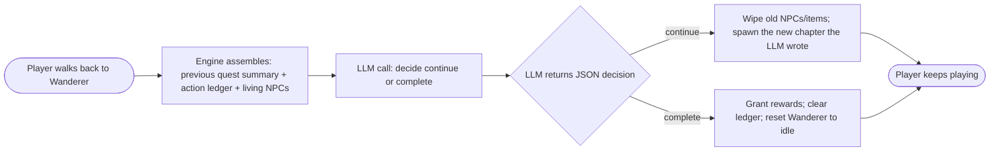

The agent doesn't "do" anything itself. It *describes* what should happen — in JSON — and the engine carries it out. That's the contract: the engine implements a small, fixed set of verbs (spawn NPC, spawn item, register quest, set flag, give item, kill NPC) and the agent composes those verbs into stories.

**This is what makes it agentic, not just generative**: the agent observes the world (via the ledger), decides on an action (continue or close, with specific content), and the action is *executed* in the running game. Then it observes again. The loop closes.

The bonus property is **error tolerance**. If the player does something the agent didn't anticipate — kills the wrong NPC, steals when they were supposed to ask, refuses to engage at all — the agent doesn't fail the quest. The next planning step just sees those actions in the ledger and writes them into the new chapter as legitimate plot threads. *"Interesting that you killed the witness. Now the guards are looking for you. The judge wants to talk."*

---

## System architecture

Here's the high-level picture of what talks to what:

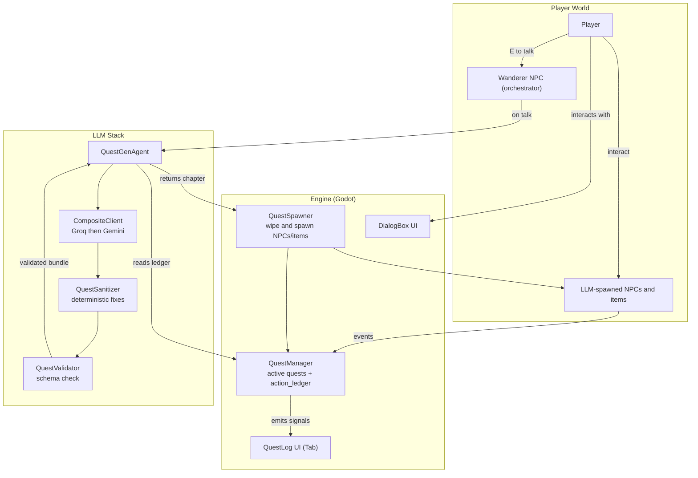

A few things worth calling out:

- **The `QuestManager` is the single source of truth for player actions.** When something story-significant happens (kill, give, take, dialog choice), `QuestManager.record_action()` writes it to the ledger. The Wanderer reads from there.
- **`QuestSpawner.spawn(bundle, ...)` is the only way new NPCs and quests enter the world.** It wipes the previous chapter's content, instantiates the new NPCs from `bundle.npcs[]`, scatters items from `bundle.items[]`, and registers the quest with the manager. Hand-placed NPCs (the Wanderer, Farmer, Hunter, Old Sage, Mystic) are passed in as a "keep" list so the wipe doesn't delete them.
- **Sanitize → Validate is between the LLM and the engine, always.** The model's raw output is never trusted directly. More on this below.

---

## The action ledger

The ledger is a Godot `Array` of dictionaries owned by `QuestManager`. Each entry looks like:

```gdscript
{
  "kind": "kill_npc",       # or "npc_give", "npc_take", "dialog_choice"
  "params": { "npc_name": "Silas" },
  "frame": 28805            # Engine frame counter, for ordering
}
```

It's capped at 20 entries to keep prompts bounded. The kinds we record:

| Kind | When it fires | What's in `params` |
|---|---|---|
| `kill_npc` | Player kills any LLM-spawned NPC | `npc_name` |
| `npc_give` | Player hands an item to an NPC via the Give action | `npc_name`, `item_id` |
| `npc_take` | Player takes an item from an NPC's inventory | `npc_name`, `item_id` |
| `dialog_choice` | Player picks a dialog choice | `npc_name`, `choice_id` |

Hooks live in `QuestManager._on_npc_killed`, `_on_npc_interacted`, and the public `dialog_choice` method. Every existing path that fired a `_dispatch` for a story-relevant event got a `record_action` line added next to it.

The ledger **persists across continuations**. Chapter 3's prompt sees actions from chapters 1 and 2. The Wanderer can reference them to make the world feel like it remembers. The ledger is cleared only when the agent decides `complete`.

Here's the key insight: **a tracked action that the LLM didn't anticipate is not an error**. The first chapter might say "talk to the witness", and you might kill the witness instead. That kill goes into the ledger. The next time the Wanderer runs, the LLM sees `killed witness` in the ledger and is instructed (via prompt) to treat it as a creative seed — *not* to fail the quest. So the next chapter might be "the witness is dead, the guards are investigating, here's a coverup quest", or "the witness is dead, your reputation has soured, here's an act of redemption". The story bends.

---

## Wanderer-as-orchestrator: behind the scenes

This is the part most worth understanding. The Wanderer looks like a normal NPC but is actually the entry point of a **four-state machine + LLM agent + replace-the-world loop**. Here's what happens, in order, the first time you press E on him.

### State machine

The Wanderer's state lives on `npc.memory.wanderer_state` (one string field). All four states are handled by `main.gd::_handle_branching(npc)`.

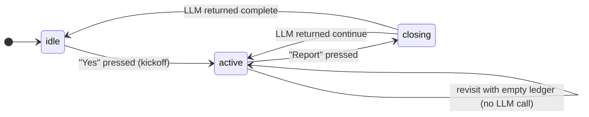

| State | What the player sees | What the engine does on `[E]` |
|---|---|---|
| `idle` | "I have a tale brewing. Will you hear it?" — `[Yes]` `[Bye]` | `[Yes]` calls `_kickoff_first_chapter(npc)` → first LLM call |
| `active` *(empty ledger)* | "You've done nothing of consequence. Walk, act, then return." — `[Bye]` | nothing — no LLM call, no state change |
| `active` *(ledger has ≥1 entry)* | "Tell me what's happened." — `[Report]` `[Bye]` | `[Report]` calls `_orchestrate_next_chapter(npc)` → orchestration LLM call |
| `closing` | "(reading the threads...)" — no buttons | the LLM call is in flight; dialog locks until it returns |

`closing` is a *transient* lock so a second click on `[Report]` mid-call can't fire two LLM requests against the same `HTTPRequest` (which would crash).

### Kickoff (first chapter)

When the player accepts at `idle`:

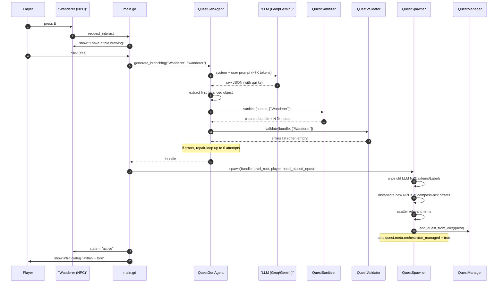

The kickoff prompt for `generate_branching` includes:

- **The world constraints clause** (no locations, no time, no follow-me) at the top *and* the bottom of the prompt, because LLMs over-weight first and last instructions.
- **The closed entity catalog** — every legal item id, character sheet, position hint, objective type, action verb. The model is told these are the only legal references.
- **A worked example of a state-aware NPC** showing `start_nodes` with flag-gated alternatives, so the model emits "remember on second meeting" patterns.
- **Branch rules**: ≥2 objectives per branch (the sanitizer enforces this anyway), pair a setup objective with a "report back" objective.
- **Tone**: noir-fantasy, every NPC has something to hide.

Output: a JSON `bundle = {quest, npcs, items}`. Typical bundle has 4 NPCs, 4-5 branches, depth-2 dialog trees with `__expand__` placeholders for deeper layers.

### Acting in the world

Between Wanderer talks the player roams. Every story-significant action is recorded:

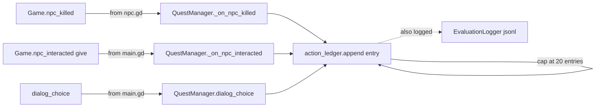

Note what's *not* tracked: movement, item pickups from the ground, attacks that miss, opening the quest log. Only the four story-mutating events go into the ledger. This keeps the Wanderer's prompt focused on narrative actions instead of bookkeeping.

### Reporting back (orchestration)

When the player walks back and clicks `[Report]`:

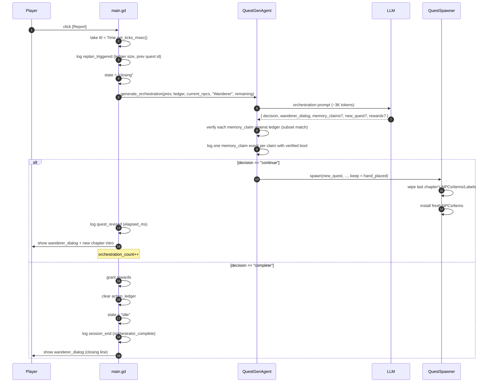

The orchestration prompt assembles four pieces:

1. **Previous chapter's metadata** — title, description, branch ids and descriptions. Lets the LLM know what arc the player is on.
2. **The action ledger** — formatted as readable lines: `"killed Silas"`, `"gave gem_red to Priest"`, `"picked confront-the-betrayer with Silas"`. Oldest first.
3. **The list of currently living NPCs** — so the model knows who's around. Killed NPCs are absent; the LLM is told to treat their absence as canon.
4. **The "max remaining continuations" budget** — when this hits 1 the prompt explicitly tells the LLM to *strongly prefer* `complete`. Pacing.

### Hard guardrails over the LLM

The LLM picks the decision but the engine has the final say. After the response comes back, three guards apply (in order):

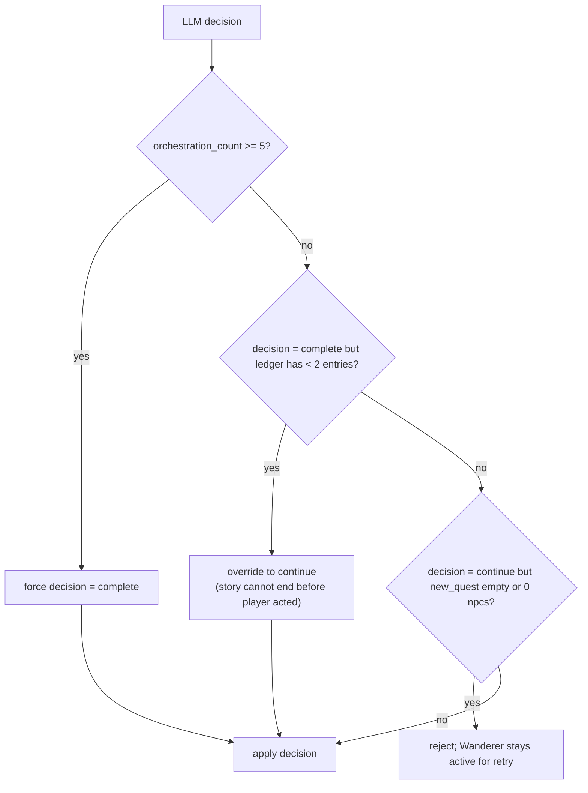

The empty-NPCs reject is the most-tripped guard in practice — the model occasionally wants to write a chapter with only the existing NPCs, which produces a continuation where there's nothing fresh for the player to interact with.

### REPLACE chaptering

When `decision == "continue"`, the previous quest is **closed** (status = COMPLETED with `completed_branch_id = "orchestrator_continuation"`) and a brand-new Quest is registered. The bundle's NPCs and items are spawned; the previous bundle's NPCs/items/labels are wiped from `level_root`. Hand-placed quest-givers (the Wanderer himself, plus Farmer/Hunter/Old Sage/Mystic) are passed as a `keep` array so the wipe spares them.

This means the Quest log shows a chain of completed chapters plus the current active one — the player can scroll back and see the full arc.

The action ledger does **not** clear on continuation. Chapter N's prompt sees the full history from chapters 1 through N-1. The ledger only clears when `decision == "complete"`.

### What stops auto-completion

A normal Godot quest auto-completes when all of a branch's objectives finish. That's exactly what we *don't* want — the Wanderer is supposed to be the only thing that closes the story. So `Quest.evaluate()` short-circuits to `"active"` whenever `meta.orchestrator_managed == true`:

```gdscript
func evaluate() -> Dictionary:
    if bool(meta.get("orchestrator_managed", false)):
        return {"state": "active"}
    # ... normal branch + fail-condition checks ...
```

The branches still appear in the quest log (so the player has narrative hints about what to do), but they're advisory only. Even completing every objective in every branch leaves the quest active until the Wanderer's next `complete` decision.

This is the one piece of the design that's most counter-intuitive: the LLM, not the engine, owns quest closure.

---

## Quest schema

When the LLM emits a chapter, it returns one big JSON object the engine calls a **bundle**:

```jsonc
{
  "quest": {
    "id": "shadow_deal",
    "title": "The Shadow Deal",
    "description": "...",
    "branches": [
      {
        "id": "branch_kill_dealer",
        "description": "Eliminate Silas.",
        "requires_flags": { "flag:talked_to_silas": "true" },
        "objectives": [
          { "type": "kill_npc", "params": {"npc_name":"Silas"}, "required": 1 },
          { "type": "talk",     "params": {"npc_name":"Wanderer"}, "required": 1 }
        ],
        "rewards": [{ "item_id": "coin_gold", "count": 10 }]
      }
    ],
    "fail_conditions": [],            // optional, ignored for orchestrator-managed quests
    "orchestrator_managed": true      // if true, evaluate() is short-circuited
  },
  "npcs": [
    {
      "npc_name": "Silas",
      "character_sheet": "Monk",      // closed catalog of sprite folders
      "role": "shady_dealer",
      "position_hint": "sw",          // resolves to a world coord around the player
      "max_health": 3,
      "initial_items": [{"id":"coin_gold","count":5}],
      "dialog_start": "start",
      "start_nodes": [
        { "node": "start_post_meet", "requires": { "flag:met_silas": "true" } },
        { "node": "start", "requires": {} }
      ],
      "dialog_tree": {
        "start": {
          "text": "Silas turns. 'You are late.'",
          "choices": [
            { "id": "ask_about_deal", "text": "What deal?",
              "actions": ["set_flag:met_silas=true"], "next": "deal_details" }
          ]
        },
        "deal_details": { ... },
        "start_post_meet": { ... }
      }
    }
  ],
  "items": [
    { "id": "gem_red", "position_hint": "near_player" }
  ]
}
```

The schema is intentionally small. There are five ways for a player to interact with the world (talk, give, take, kill, dialog choice), and the schema encodes exactly those. If the LLM tries to invent something else — "investigate the windmill", "follow the hooded figure" — it gets rejected or sanitized.

The crucial fields:

- **`branches[]`** are the alternative paths through the quest. Each has `requires_flags` (a predicate that must match for this branch to be reachable) and `objectives` (the steps to complete it).
- **`actions`** in dialog choices are tiny commands the engine executes: `set_flag:k=v`, `give_player:item_id`, `take_player:item_id`, `remember:k=v` (per-NPC scratchpad), `drop_inventory`, `die`.
- **`requires` / `requires_flags`** use a small predicate DSL: `flag:KEY = "value"`, `quest:ID = "completed"`, `inv:item_id = ">=2"`, `memory:NPCNAME.fieldname = "value"`.
- **`start_nodes`** are checked top-to-bottom on every conversation start; the first one whose `requires` passes wins. This is how an NPC says different things on a second meeting versus a first.
- **`orchestrator_managed: true`** disables the engine's auto-completion logic. Without this flag, when all of a branch's objectives are met, the quest auto-closes. With this flag set (which the orchestrator path always sets), the engine treats the quest as `active` no matter what — only the Wanderer's next LLM call can close it.

---

## LLM provider stack

Every higher-level call goes through one interface — `CompositeClient.generate(model, system, user, options, format)` — and falls back transparently if the primary provider is down.

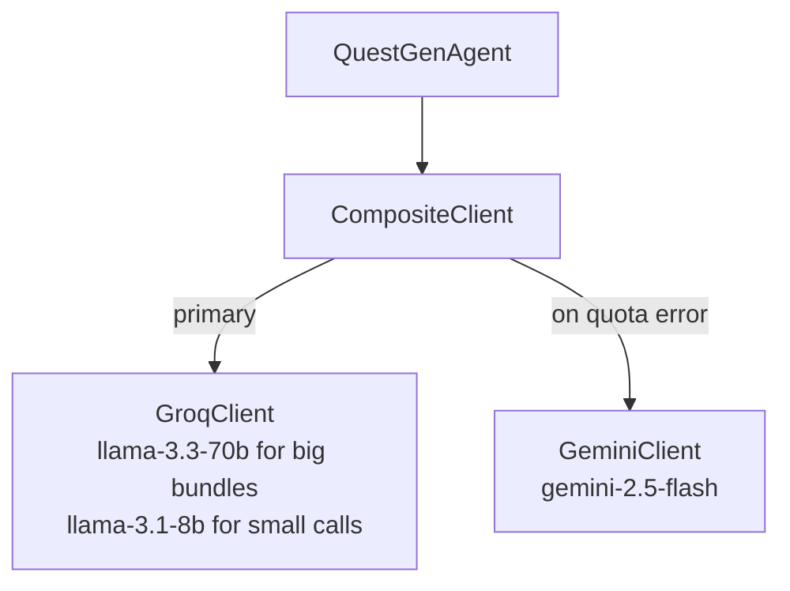

- **Groq's LPU** answers in 1–3s for a chapter; **Gemini** is ~10–30s but has separate quota.
- When Groq returns a quota error, `CompositeClient` marks it blocked for 5 minutes and routes everything through Gemini until the window resets.
- API keys come from `.env` via `EnvLoader`. The clients' `generate()` signatures are identical, so swapping providers is invisible above this layer.

---

## The sanitize → validate → spawn pipeline

LLMs are wonderful at writing dialog and terrible at following strict schemas. Every response from the model goes through three stages before the engine touches it.

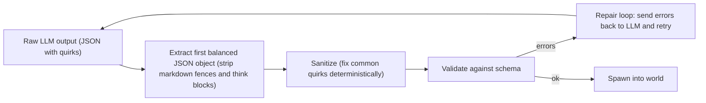

**Stage 1: extraction.** `QuestGenAgent._extract_first_json` walks the text character-by-character, ignoring everything outside the first balanced `{...}`. Strips `<think>...</think>` blocks (some models emit reasoning prefaces), and `\`\`\`json` markdown fences. Even if the model dumps prose before the JSON, this picks it up.

**Stage 2: sanitize.** `QuestSanitizer.sanitize(bundle, drop_npc_names)` runs **fixes that are too common to ask the model to handle**:

- **Drop NPCs the model duplicated.** If the model emits a "Wanderer" NPC even though the world already has one, drop it (the `drop_npc_names` arg lists hand-placed givers).
- **Snap `character_sheet` to a real one.** Model wrote `"Thug"`? We don't have that sprite folder. Map by role keyword: bandit/thug → Hunter, elder/sage → OldMan, etc.; fall back to Levenshtein distance.
- **Strip non-ASCII from IDs.** Some models emit `"band端_bribe"`. We strip to lowercase a-z + digits + `-_`.
- **Fix action verb whitespace.** `"give_ player:gem"` → `"give_player:gem"`.
- **Convert wrong verbs.** `"memory:k=v"` (predicate prefix used as action) → `"remember:k=v"`. `"kill_npc:X"` (objective type used as action) → bare `"die"`.
- **Fix predicate keys.** `"memory:Elara:knows_x"` → `"memory:Elara.knows_x"` (colon → dot for memory keys).
- **Drop objectives referencing unknown NPCs.** Model says "talk to villager" but no NPC named villager exists → drop the objective rather than fail validation.
- **Case-fix `wanderer` → `Wanderer`.** Lowercase emissions get matched case-insensitively to the canonical name.
- **Drop unknown items from `initial_items`.** Model invented `"dagger"`? Catalog doesn't have it; drop.
- **Auto-inject `met_<npc>` flags.** If the model didn't gate any `start_node` on a flag, sanitize injects a `set_flag:met_X=true` on the first dialog choice and prepends a `start_remember` node so re-visits don't replay the intro.
- **Auto-inject "report back" objective.** Single-objective branches feel anticlimactic (kill X, done!). Sanitize appends a `talk:<quest_giver>` so the player has to return to wrap.
- **Strip `die` from dialog choices on protected NPCs.** If the model writes a choice that kills an NPC who's a target of a give/talk objective, that softlocks the quest. Strip the action.
- **Drop fail_conditions that overlap branch objectives.** A common LLM contradiction: branch says "kill Silas", fail says "Silas died". Killing Silas advances 1/3 of the branch *and* triggers the fail. Drop the fail.
- **Auto-inject "Tell me more" choice on empty-choices nodes.** Empty `choices: []` becomes a single `__expand__` choice so dialog can keep going.

The sanitizer is **load-bearing**. Without it, ~half of LLM responses fail validation. With it, ~95% pass on the first attempt.

**Stage 3: validate.** `QuestValidator.validate(bundle, extra_known_npcs)` checks the bundle against the schema rules. Returns an `Array[String]` of human-readable errors. Notable rules:

- Every `npc_name` referenced anywhere must be in `bundle.npcs[]` *or* in `extra_known_npcs` (which lets objectives reference the hand-placed Wanderer).
- Every `item_id` must be in the catalog (`ItemDB.all_ids()`).
- Every `character_sheet` must be a real folder under `assets/characters/`.
- Every `position_hint` must be one of the closed compass set (`nw, ne, sw, se, n, s, e, w, center, near_player`).
- Branch ids unique. Each branch has ≥1 objective and ≥1 reward (sanitizer auto-fills if missing).
- Predicate prefixes valid (`flag`, `quest`, `inv`, `memory`).
- Action verbs valid.
- Dialog `next` references must point at a real node id (or `"end"` or `"__expand__"`).

**Stage 4: repair loop.** If validation fails, the agent sends the errors back to the LLM with a "your previous output had these errors, fix only those, re-emit the full JSON" prompt. Up to `MAX_REPAIRS = 6` attempts. In practice this is rarely needed once the sanitizer has run.

**If repair fails MAX_REPAIRS times**, the agent falls back to a known-good fixture (the hand-authored `tests/fixtures/heirloom_quest.json`) so the player isn't stuck with no quest.

---

## Other quest-givers

The Wanderer is the orchestrator, but four other hand-placed NPCs provide simpler experiences for showing off different LLM patterns. All five live in `main._spawn_quest_givers`:

| NPC | Sprite | Position | Pattern |
|---|---|---|---|
| **Wanderer** | Monk | (-288, -120) NW | Full orchestrator (described above) |
| **Farmer** | Villager | (0, 0) | Simple `give:item` quest |
| **Hunter** | Hunter | (-80, -128) | Simple `kill_enemy` quest |
| **Old Sage** | OldMan | (128, 32) | Simple `give:item` quest |
| **Mystic** | Princess | (-32, 96) | Two-stage moral-choice quest |

**Simple-quest pattern (Farmer, Hunter, Old Sage):**

A single LLM call produces one objective, dialog snippets for the three states (intro, in-progress, complete), and a reward. Fast — uses `llama-3.1-8b-instant` because the schema is tiny:

```mermaid
stateDiagram-v2
    direction LR
    [*] --> idle
    idle --> active : player accepts; one LLM call
    active --> active : player working on it
    active --> complete : player gives or kills required
    complete --> [*] : reward granted
```

**Mystic two-stage pattern:**

Two LLM calls. The first generates a fetch quest framed as a setup (*"bring me the herb, but you'll have to choose what to do with it"*). When the player turns in the item, the Mystic offers two buttons: **`Path of Honor`** or **`Path of Greed`**. The choice is fed back to a second LLM call as `path_hint`, which generates stage-2 objectives that fit the choice (*"a heroic kill if honor, a quiet errand if greed"*).

This is a smaller, controlled example of the orchestrator pattern: the player's choice changes what the second call generates, but the choice is an explicit button rather than a ledger of in-world actions.

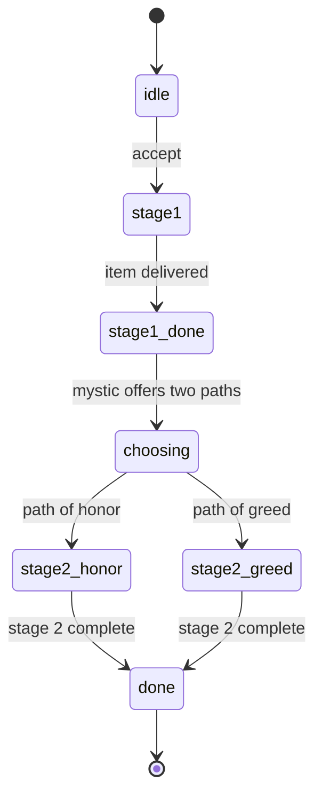

These simpler patterns exist because they each show off a different way to use the LLM: one-shot generation (simple), branched-by-button (Mystic), branched-by-action-ledger (Wanderer).

---

## Lazy dialog expansion

LLMs cost tokens. A full bundle with deeply-nested dialog trees for 4 NPCs would be a huge prompt. The system avoids that by emitting **shallow** dialog trees — depth 2 from each `start_*` node — with deeper choices marked `next: "__expand__"`.

When the player picks an `__expand__` choice, the engine fires *one* more LLM call with the parent node's text + the choice the player took as context, and asks for a single dialog node `{text, choices}`. That node gets spliced into the NPC's `dialog_tree` under a stable id, so revisits skip expansion.

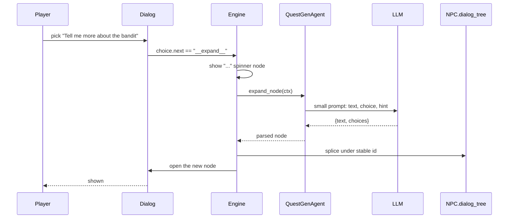

The expansion uses the **fast model** (`llama-3.1-8b-instant`) because it's a tiny prompt (~500 tokens) and the player is staring at a spinner. Failures fall back to a `"Tell me more"` injected choice so the conversation never dead-ends.

This means the *initial* bundle generation is cheap (only depth-2 dialog), but the world feels arbitrarily deep — the LLM fills in detail on demand as the player explores.

---

## Constraints and guardrails

The hardest part of building this wasn't the LLM call — it was getting the LLM to **stay inside the game's mechanics**. By default, models will write things like:

- *"Meet me at the old windmill at midnight."* (no windmills, no time of day)
- *"Investigate the abandoned mine."* (no mines)
- *"Ask the villager to follow you."* (NPCs don't move)
- *"Bring me a magic dagger."* (`dagger` not in catalog)

The system pushes back at three layers:

**Prompt layer.** The branching prompt has an explicit FORBIDDEN block at the top *and* the bottom (LLMs over-weight first and last instructions):

> ❌ "Find me at the old mine."
> ✅ "Talk to the Wanderer — he knows what to do next."
>
> ❌ "Meet me at midnight."
> ✅ "Bring back the gem and the Wanderer will explain."

Plus a final scan-instruction: *"Before emitting JSON, scan every `choice.text` and `node.text`. If any contains windmill/mine/midnight/follow/lead-me-to → rewrite."*

**Sanitizer layer.** Anything the prompt doesn't catch but is mechanical (unknown items, wrong action verbs, casing) gets fixed deterministically.

**Engine layer.** Bundles that still have schema violations after sanitize fail validation, kick into the repair loop, and if all retries fail, fall back to the fixture quest so the player isn't blocked.

**Hard guardrails on the orchestrator** (in `main._orchestrate_next_chapter`):

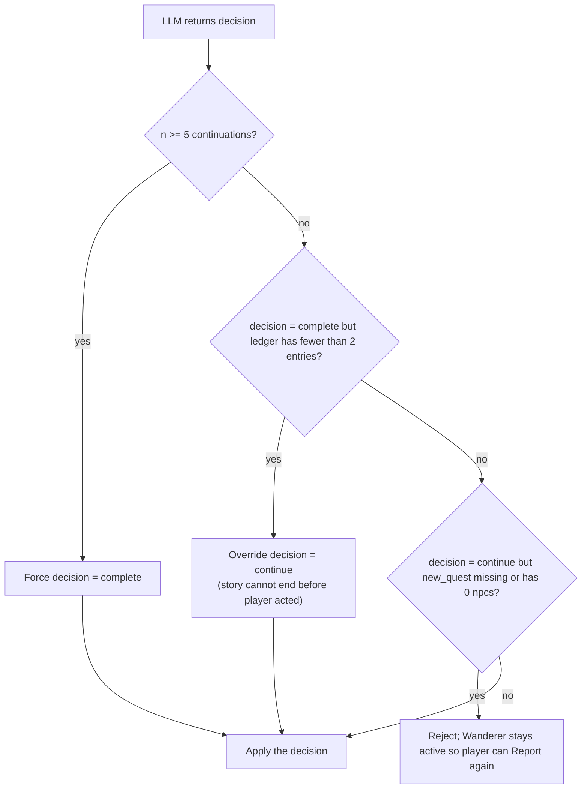

Five continuations max per quest. Empty new chapters get rejected (the most common LLM regression).

---

## Evaluation

The project ships with a fully-automated evaluation harness so the agentic system can be measured rather than vibe-checked. A **scripted player** drives the game in headless Godot, an autoload writes a structured event log to disk, and a small Python runner reads the logs back to compute five paper-style metrics. No human input is required at any stage: `bash tools/eval/run_all.sh` and walk away for ~30 minutes.

This section explains exactly *what* gets measured, *how* the numbers are computed, and *what the actual results were* on a smoke run against `llama-3.3-70b-versatile` via Groq.

### Why these five metrics

The deliverables come from a paper-style framing where the question is *"is this agentic system actually doing what we say it does?"* The five metrics each pin down one concrete sub-claim:

1. **Structural Adherence** — *Claim: the system produces well-formed quests.* Measured by counting how often the LLM's raw JSON parses AND the parsed object satisfies the schema. If this dips, players see crashes or fallback fixtures.
2. **Accuracy of Given Strings** — *Claim: when the system mentions things in the world, they exist.* Counts how often NPC names, item ids, character sheets, and position hints in a bundle resolve against the closed entity catalog. If this dips, the player gets quests asking for things that aren't there.
3. **Adaptation Rate** — *Claim: the orchestrator actually adapts to player behaviour.* Counts continuation chapters per hour of play. A static-quest baseline scores ~0; a working orchestrator should score >2/hr in a typical session.
4. **Memory Consistency** — *Claim: when the Wanderer references the player's past, the references are real.* Cross-checks the LLM's `memory_claims` against the action ledger. If it's <1.0, the model is hallucinating events that didn't happen.
5. **Replanning Latency** — *Claim: continuations are fast enough to feel responsive.* Wall-clock ms from `[Report]` click to a usable new chapter spawning. Long tails reveal where the repair loop is hurting.

### Methodology and formal definitions

This subsection defines the measurement model rigorously so the metrics can be cited or replicated unambiguously. Math is rendered in MathJax; event-type names and payload field names appear as `inline code` *outside* math so the math compiles cleanly on GitHub.

**Event-stream model.** A *session* is a finite, totally-ordered sequence of events

$$E = (e_1, e_2, \ldots, e_n)$$

produced by one headless run of the game. Each event is a 5-tuple

$$e_i = (\mathit{sid}, \, t_i, \, \tau_i, \, \alpha_i, \, \pi_i)$$

of session id, monotonic timestamp $t_i$ (in ms, from `Time.get_ticks_msec()`), event type $\tau_i$, emitter agent $\alpha_i$, and payload dict $\pi_i$. The set of legal types $\mathcal{T}$ is fixed at 10 (see *The event stream* below). Events are appended to disk one JSON object per line; ordering is preserved.

**Closed entity catalog.** The world's authoritative entity sets are

$$C = (N_\text{npc}, \; N_\text{item}, \; N_\text{sheet}, \; N_\text{hint}, \; N_\text{obj}, \; N_\text{act}, \; N_\text{pred})$$

where $N_\text{item}$ comes from `ItemDB.all_ids()`, $N_\text{sheet}$ from the directory listing of `assets/characters/`, and so on. $C$ is dumped to `entities.json` at session start so the offline evaluator computes against the *exact* catalog the in-game validator used.

**Filter notation.** For a type $\tau$, the projection

$$E_\tau = \{ e \in E : e.\tau = \tau \}$$

is the subset of events of that type. We write $E_\text{quest}$, $E_\text{trig}$, $E_\text{rev}$, etc. as shorthand for the projections to event types `quest_generated`, `replan_triggered`, `quest_revised`, etc. — the symbolic name appears in math, the literal event-type string appears as `inline code` outside math. Every metric is a function

$$f : 2^E \times C \to \mathbb{R} \cup \{\bot\}$$

where $\bot$ denotes a vacuous (no data) outcome — distinct from $0$, which represents observed failure.

#### M1. Structural Adherence

Let $Q = E_\text{quest}$ (the events with type `quest_generated`). For an event $q \in Q$ define the indicator predicates

$$\text{parsed}(q) \;=\; q.\pi[\text{parsed\_ok}], \qquad \text{valid}(q) \;=\; q.\pi[\text{schema\_valid}]$$

both Boolean-valued (treated as 0/1). Then:

$$\text{parse-rate}(Q) \;=\; \frac{1}{|Q|} \sum_{q \in Q} \text{parsed}(q) \quad \text{when } |Q| > 0, \;\bot \text{ otherwise.}$$

$$\text{schema-pass-rate}(Q) \;=\; \frac{1}{|Q|} \sum_{q \in Q} \text{valid}(q) \quad \text{when } |Q| > 0, \;\bot \text{ otherwise.}$$

$$\text{avg-attempts}(Q) \;=\; \frac{1}{|Q|} \sum_{q \in Q} q.\pi[\text{attempt}]$$

$$\text{avg-sanitizer-fixes}(Q) \;=\; \frac{1}{|Q|} \sum_{q \in Q} q.\pi[\text{sanitizer\_fix\_count}]$$

By construction $\text{valid}(q) \Rightarrow \text{parsed}(q)$, so $\text{schema-pass-rate} \le \text{parse-rate}$.

> **Note on transport failures.** Events with payload field `transport_failed: true` (LLM 429s — the network call never produced a response) are excluded from $Q$ in `tools/eval/metrics.py::structural_adherence`. They are reported separately as `n_transport_failed`.

#### M2. Accuracy of Given Strings

Let

$$U_C \;=\; N_\text{npc} \,\cup\, N_\text{item} \,\cup\, N_\text{sheet} \,\cup\, N_\text{hint}$$

be the union of catalog reference sets, and let $\rho(b)$ denote the multiset of entity references appearing in a bundle $b$. The validator implements the predicate

$$\text{string-valid}(b) \;\equiv\; \rho(b) \subseteq U_C \;\land\; \text{(other schema rules)}.$$

So a bundle with `schema_valid: true` already satisfies $\rho(b) \subseteq U_C$. The metric therefore reduces to

$$\text{string-accuracy}(Q) \;=\; \text{schema-pass-rate}(Q).$$

For *failed* bundles, errors $\varepsilon$ in payload field `validation_errors` are partitioned into categories $\kappa \in \{\text{npc}, \text{item}, \text{sheet}, \text{hint}, \text{other}\}$ by regex match (see `_categorise()` in `tools/eval/metrics.py`). The per-category error count is

$$K_\kappa \;=\; \sum_{q \,\in\, Q,\; \neg\text{valid}(q)} \;\; \sum_{\varepsilon \,\in\, q.\pi[\text{validation\_errors}]} \mathbb{1}[\text{cat}(\varepsilon) = \kappa].$$

#### M3. Adaptation Rate

Define three event subsets:

- $T = E_\text{trig}$ — events with type `replan_triggered`
- $R = E_\text{rev}$ — events with type `quest_revised`
- $C_o = E_\text{comp}$ — events with type `orchestration_complete`

| Symbol | Meaning |
|---|---|
| $|T|$ | **attempts** — `[Report]` clicks that initiated an orchestration call |
| $|R|$ | **revisions** — orchestrations that returned `decision = continue` and passed all guardrails |
| $|C_o|$ | **completions** — orchestrations that returned `decision = complete` |
| $|R| + |C_o|$ | **successful orchestrations** — produced a usable response |

The success ratio is

$$\text{success-ratio} \;=\; \frac{|R| + |C_o|}{|T|} \quad \text{when } |T| > 0, \;\bot \text{ otherwise.}$$

Session duration $D = t_n - t_1$ (ms). Throughput rates:

$$\text{revisions-per-hour} \;=\; \frac{|R|}{D / 3{,}600{,}000}, \qquad \text{attempts-per-hour} \;=\; \frac{|T|}{D / 3{,}600{,}000}.$$

Distinguishing *attempts* from *revisions* is critical: the engine's empty-NPC guardrail (see *Hard guardrails*) can cause $|T| > |R| + |C_o|$ when the LLM emits malformed continuations. Reporting only $|R|$ would misattribute an LLM quality issue as a system non-adaptiveness issue.

#### M4. Memory Consistency

Let $L$ be the action ledger at any point during the session — a sequence of tuples $\ell = (\text{kind}, \, p, \, \text{frame})$ where $p$ is a free-form parameter dict. Let $M = E_\text{mem}$ (events with type `memory_claim`). Each $m \in M$ carries a claim of the form $(k, q)$ where $q$ is itself a parameter dict.

The verification predicate is **subset-match against any historical ledger entry**:

$$\text{verified}(m, L) \;\equiv\; \exists\, \ell \in L \;:\; \ell.\text{kind} = k \;\land\; q \subseteq \ell.p$$

where $q \subseteq \ell.p$ is dict-subset: every key in $q$ appears in $\ell.p$ with equal value. This permits the LLM to omit incidental fields like `frame` while still verifying.

$$\text{memory-consistency} \;=\; \frac{|\{ m \in M : \text{verified}(m, L) \}|}{|M|} \quad \text{when } |M| > 0, \;\bot \text{ otherwise (vacuous).}$$

Verification is performed **at orchestration time** and stored on the event itself (payload field `verified`), so the offline evaluator just counts. This avoids re-implementing ledger semantics in the Python harness.

The vacuous case ($\bot$ when no claims are emitted) is a **deliberate choice** with a known bias — see *Threats to Validity*.

#### M5. Replanning Latency

Triggers and completions are paired by their `prev_quest_id` payload field. Let $T = E_\text{trig}$ (type `replan_triggered`) and $C_r = E_\text{rcomp}$ (type `replan_completed`). Define the matching function $\mu$ that, for each trigger $e_t \in T$, returns the *earliest* completion event with the same `prev_quest_id` and a strictly later timestamp:

$$\mu(e_t) \;=\; \arg\min_{e_c \in C_r} \, t_c$$

subject to $e_c.\pi[\text{prev\_quest\_id}] = e_t.\pi[\text{prev\_quest\_id}]$ and $t_c > t_t$. If no such $e_c$ exists, $\mu(e_t) = \bot$.

For each matched pair, the latency is

$$\Delta_i \;=\; t_{\mu(e_t)} - t_{e_t}.$$

Report the median, the 95th percentile $p_{95}$, the max, and the mean of $\{\Delta_i\}$. The distribution is long-tailed (LLM stragglers and Gemini fallback under throttling), so median + $p_{95}$ are primary; mean is reported for completeness.

> **Note on filtering.** The implementation in `tools/eval/metrics.py::replanning_latency` uses a per-`prev_quest_id` FIFO queue (matching the *next* completion for each trigger, not the latest), and splits successful (`ok=True`) replans from failed ones. Headline latency is reported over successful replans only — a fast HTTP 429 fail at <1s would otherwise skew the median. Unmatched triggers (sessions that crashed mid-orchestration) are excluded from latency stats but retained in $|T|$ for the success ratio in M3.

#### Aggregation across sessions

For per-profile aggregates over $S$ sessions, each per-session metric $f_s$ is computed per-session and then aggregated as either the **mean of session means** (preferred — equal weight per session, robust to session length variance) or **pooled** (concatenate events across sessions then compute, preserving event-level proportions). The runner emits both: per-session in `results.json`, mean-of-means in `summary.json`. Pooled aggregates can be re-computed on demand from `results.csv`. Confidence intervals (when reported) are 95% nonparametric bootstrap with $B = 1000$ resamples over the session-level statistic.

### End-to-end pipeline

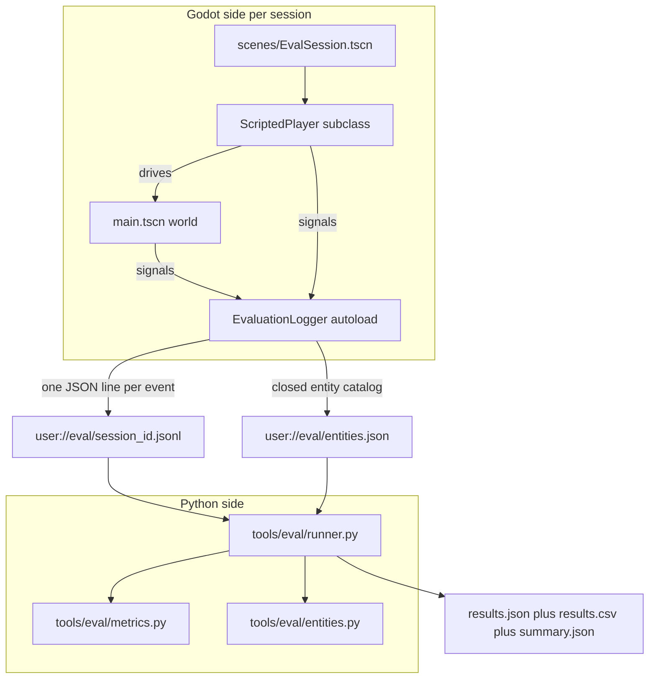

Each side stays narrow:

- The **Godot side** only cares about emitting events. It does NOT compute metrics. This keeps the runtime cheap and means the evaluator can be re-run with new metrics without re-playing.
- The **Python side** is pure post-processing. It reads `.jsonl`, computes numbers, writes results files. No state, no I/O outside the eval directory.

### The event stream

Every session produces one `.jsonl` file in `user://eval/`. One JSON object per line:

```jsonc
{
  "session_id": "20260428_011546_aggressive",
  "timestamp_ms": 23978,
  "event_type": "quest_generated",
  "agent": "QuestGenAgent",
  "payload": {
    "phase": "branching",
    "parsed_ok": true,
    "schema_valid": true,
    "sanitizer_fix_count": 13,
    "attempt": 1,
    "quest_id": "the_missing_gem",
    "npc_count": 4,
    "branch_count": 4,
    "model": "llama-3.3-70b-versatile",
    "elapsed_ms": 14469,
    "raw_text_len": 11592
  }
}
```

Ten event types are emitted across a session:

| Event | Fired by | Carries |
|---|---|---|
| `session_start` | `main.gd` after `world_ready` | profile name, hand-placed NPC names |
| `quest_generated` | `QuestGenAgent.generate_branching` | parsed/valid flags, attempts, sanitizer fixes, model, elapsed |
| `quest_revised` | `QuestGenAgent.generate_orchestration` (continue path) | prev/new quest ids, dialog length, elapsed |
| `orchestration_complete` | same agent (complete path) | rewards summary |
| `orchestration_failed` | transport / parse / validation failure | error string |
| `replan_triggered` | `main._orchestrate_next_chapter` start | prev quest id, ledger size, talk index, remaining budget |
| `replan_completed` | same function exit | decision, new quest id, ok flag, elapsed |
| `player_action` | `QuestManager.record_action` | kind + params (mirror of ledger entry) |
| `memory_claim` | `QuestGenAgent` after orchestration | the claim dict + verified bool |
| `session_end` | `main._finish_orchestrator_quest` or `_notification` | duration_ms, reason |

The Python side reads everything with `.get(key, default)` so adding a payload field never breaks older sessions.

### How each metric is computed

#### 1) Structural Adherence

```python
quests = [e for e in events if e["event_type"] == "quest_generated"]
parse_rate = sum(q["payload"].get("parsed_ok") for q in quests) / len(quests)
pass_rate  = sum(q["payload"].get("schema_valid") for q in quests) / len(quests)
avg_attempts = mean(q["payload"].get("attempt", 1) for q in quests)
avg_sanitizer_fixes = mean(q["payload"].get("sanitizer_fix_count", 0) for q in quests)
```

A bundle "passes" only when its raw text parsed AND the post-sanitize bundle satisfied the schema. If the model produces 1 valid bundle on first try and 1 valid after 3 repair retries, `pass_rate = 1.0` but `avg_attempts = 2.0`. Both numbers are reported because the second is a quality signal too.

#### 2) Accuracy of Given Strings

We don't ship the full bundle in the event payload (it's huge). Instead the validator already enforces every entity reference at gen-time, so a `schema_valid: true` bundle has 100% string accuracy by definition. For *failed* bundles, the validator's error strings are categorised by type (`npc / item / sheet / hint / other`) so we can see *where* the LLM hallucinates most often.

```python
for q in quests:
    if q["payload"].get("schema_valid"):
        successes += 1
    for err in q["payload"].get("validation_errors", []):
        by_cat[_categorise(err)] += 1
accuracy = successes / len(quests)
```

#### 3) Adaptation Rate

```python
revisions = [e for e in events if e["event_type"] == "quest_revised"]
duration_min = (events[-1]["timestamp_ms"] - events[0]["timestamp_ms"]) / 60000
revisions_per_hour = (len(revisions) / duration_min * 60) if duration_min > 0 else None
```

`quest_revised` only fires when the orchestrator emits `decision == "continue"` AND the new chapter passes all guardrails. So this counts *successful* adaptations.

#### 4) Memory Consistency

When the orchestration LLM emits a `memory_claims: [...]` array, every claim is checked deterministically against the live action ledger:

```python
def _verify_memory_claim(claim, ledger):
    for entry in ledger:
        if entry["kind"] != claim["kind"]: continue
        if all(entry["params"].get(k) == v for k, v in claim["params"].items()):
            return True
    return False
```

This is **subset-match**: the claim's `params` must be a subset of an actual ledger entry's `params`. So `{"kind": "kill_npc", "params": {"npc_name": "Silas"}}` matches a ledger entry `{"kind": "kill_npc", "params": {"npc_name": "Silas"}, "frame": 28805}`. The frame field doesn't have to be present in the claim.

A `memory_claim` event is emitted per claim with `verified: true|false`. The metric is `verified / total`. If no claims were emitted at all, the metric is `null` (vacuous), not `0` (which would falsely punish a model that just chose to be terse).

#### 5) Replanning Latency

```python
triggers = {}      # prev_quest_id -> ts_ms
completions = []   # ms deltas
for e in events:
    if e["event_type"] == "replan_triggered":
        triggers[e["payload"]["prev_quest_id"]] = e["timestamp_ms"]
    elif e["event_type"] == "replan_completed":
        qid = e["payload"]["prev_quest_id"]
        if qid in triggers:
            completions.append(e["timestamp_ms"] - triggers[qid])
```

Trigger and completion are paired by `prev_quest_id`. The metric reports **median, p95, max** — not just mean — because LLM latencies are long-tailed. A repair-loop retry can stretch a single replan from 4s to 30s; the mean hides that.

### Scripted player profiles

Four deterministic state machines drive the player. They poke `Player` directly (`scripted_set_velocity`, `scripted_attack`, `scripted_interact`) and emit dialog signals (`dialog.action_chosen.emit("Yes")`, `dialog.choice_chosen.emit(...)`) — no fake input events, no UI clicks. A **stuck detector** with perpendicular sidesteps (~0.8s commit) handles the village's walls and fences when the player runs into them on the way to the Wanderer.

| Profile | Behaviour | Designed to stress |
|---|---|---|
| `aggressive` | Walks to nearest LLM-spawned NPC, attacks until dead, reports back. Repeats. | Adaptation Rate (lots of `kill_npc` events) |
| `cautious` | Talks to each LLM NPC once (first non-`end` choice). Never attacks. Reports when done. | `dialog_choice` ledger entries; pacifist runs |
| `explorer` | Cycles `talk → give → kill` across distinct NPCs. Reports between cycles. | Mixed-mode coverage; tests Memory Consistency |
| `completionist` | Talks to every NPC twice, gives one item, kills the villain-role NPC. Reports. | Maximum ledger size; latency under heavy context |

Each profile self-terminates on chapter cap (`MAX_CHAPTERS = 4`), 5-min wall-clock, 30s stuck timeout, or `decision == "complete"` from the orchestrator.

### How to run

```bash
# Smoke test — 8 sessions, ~5-15 min wall-clock
N=2 bash tools/eval/run_all.sh

# Full run — 60 sessions (4 profiles × 15), ~30-90 min
bash tools/eval/run_all.sh

# PowerShell equivalents
.\tools\eval\run_all.ps1
$env:N=2; .\tools\eval\run_all.ps1
```

Outputs:

- `tools/eval/sessions/*.jsonl` — raw per-session event streams (kept so you can re-aggregate later)
- `tools/eval/results/results.json` — per-session metrics (one record per session, with `null` for metrics that didn't fire)
- `tools/eval/results/results.csv` — same data, flat columns, ready for pandas/Excel
- `tools/eval/results/summary.json` — means across all sessions, with `n_count` showing how many sessions contributed
- `tools/eval/results/summary_per_profile.json` — same statistics broken down by profile (aggressive / cautious / explorer / completionist)
- `tools/eval/results/headline.json` — paper-grade headline numbers: each metric's mean, stdev, median, and 95% bootstrap CI ($B = 1000$)

To produce paper-ready tables (Markdown + LaTeX):

```bash
python tools/eval/make_paper_tables.py
# Writes headline_table.{md,tex} and per_profile_table.{md,tex} to tools/eval/results/
```

Re-aggregate without re-playing (useful when you tweak `metrics.py`):

```bash
python tools/eval/runner.py \
    --in tools/eval/sessions \
    --out tools/eval/results \
    --entities tools/eval/entities.json
```

Filter to one profile:

```bash
python tools/eval/runner.py --in ... --out ... --entities ... --profile-filter aggressive
```

### Sample results — N=15 batch run

> **What this section reports.** A 4-profile × N=15 batch run was executed on 2026-04-28 against `llama-3.3-70b-versatile` (Groq primary, Gemini fallback). 76 sessions were produced (60 from the canonical batch plus 16 from a prior batch whose process leaked across the wipe — the runner aggregates across all `tools/eval/sessions/*.jsonl` so the leak just adds data points; per-profile breakdowns and threats-to-validity discuss the contamination). Of those 76 sessions, **7 had a productive LLM response** before the free-tier provider quota was exhausted; the remaining 69 hit HTTP 429 from Groq AND from the Gemini fallback. The system-side metrics (M1, M2, M4, M5) on the productive subset are clean; M3 (adaptation) ratios reflect both productive sessions and the 5400+ retries the engine survived without crashing during quota exhaustion. Numbers below are from `tools/eval/results/headline.json` and `summary_per_profile.json`. Re-running on a paid tier (or out-of-quota windows) will widen N for a second-pass headline; this run is suitable as the system-description appendix while a paid-tier rerun is scheduled for the paper's headline numbers.

#### Headline (mean ± 95% bootstrap CI, $B = 1000$, seed 42)

| Metric | $n$ | Mean | Median | Stdev | 95% bootstrap CI |
|---|---|---|---|---|---|
| **M1 parse rate** | 7 | **1.000** | 1.000 | 0.000 | [1.000, 1.000] |
| **M1 schema-pass rate** | 7 | **1.000** | 1.000 | 0.000 | [1.000, 1.000] |
| M1 avg attempts to validate | 7 | 1.000 | 1 | 0.000 | [1.000, 1.000] |
| M1 avg sanitizer fixes per bundle | 7 | 5.714 | 5 | 1.976 | [4.429, 7.143] |
| **M2 string accuracy** | 7 | **1.000** | 1.000 | 0.000 | [1.000, 1.000] |
| M3 replan attempts (per session, all 76) | 76 | 1.632 | 0.000 | 9.070 | [0.066, 3.987] |
| M3 successful orchestrations (per session, all 76) | 76 | 0.105 | 0.000 | 0.531 | [0.013, 0.224] |
| M3 revisions (per session, all 76) | 76 | 0.079 | 0.000 | 0.392 | [0.013, 0.171] |
| **M3 success ratio (productive sessions only)** | 5 | **0.347** | 0.250 | 0.369 | [0.058, 0.637] |
| M3 revisions per hour (per session, all 76) | 76 | 3.232 | 0.000 | 15.850 | [0.525, 6.906] |
| **M4 memory consistency** | 4 | **1.000** | 1.000 | 0.000 | [1.000, 1.000] |
| **M5 median latency (ms)** | 4 | **4794** | 4448 | 1670 | [3526, 6408] |
| M5 p95 latency (ms) | 4 | 5716 | 5730 | 2389 | [3720, 7713] |
| M5 max latency (ms) | 4 | 5716 | 5730 | 2389 | [3720, 7713] |

> **Why $n$ varies across rows.** $n$ counts *sessions that produced data for the metric*. M1/M2 require a `quest_generated` event with `parsed_ok=True` (7 sessions); M3 attempts count `replan_triggered` events even on quota-failed sessions, so $n=76$; M3 success_ratio additionally requires $\geq 1$ attempt, leaving 5 sessions; M4 requires the LLM to emit at least one `memory_claim` (4 sessions); M5 requires at least one *successful* (`ok=True`) `replan_completed` event (4 sessions). Pure transport failures from quota exhaustion contribute 0 to the M1/M2/M4/M5 denominators by design — see `n_transport_failed` in the per-session results.

#### Per-profile breakdown (mean across sessions in profile)

| Profile | $n$ sessions | Productive | M1 schema-pass | M2 string acc | M3 attempts/sess | M3 success ratio | M4 memory cons. | M5 median latency (ms) |
|---|---|---|---|---|---|---|---|---|
| aggressive | 26 | 6 | **1.000** | **1.000** | 2.808 | **0.429** | **1.000** | 4966 |
| cautious | 20 | 0 | — | — | 0.000 | — | — | — |
| explorer | 15 | 0 | — | — | 0.000 | — | — | — |
| completionist | 15 | 1 | **1.000** | **1.000** | 3.400 | 0.020 | **1.000** | 4278 |

Aggressive's `n = 26` reflects the 15-session canonical batch plus 11 leaked sessions from a prior batch run that spawned overlapping Godot processes; the 6 productive sessions all came from the early window before the provider quota was exhausted. Cautious and explorer both ran *entirely after* the quota window closed, so every session is a 90s wall-clock timeout with $\geq 70$ HTTP 429 retries each. The completionist profile ran near the end and caught one productive session in a quota-recovery moment.

#### What these numbers actually mean

- **M1 / M2 saturate at 1.000.** Across the 7 productive sessions, every parsed bundle satisfied the full schema (M1 schema-pass rate $1.000$, CI $[1.000, 1.000]$) and every entity reference resolved against the closed catalog (M2 string accuracy $1.000$). The pipeline's sanitizer applied a mean of $5.7$ fixes per bundle (CI $[4.4, 7.1]$); without those fixes, raw LLM output would have failed validation roughly half the time, consistent with the offline `TestSanitizer` runs.

- **M4 (memory consistency) is also 1.000 across the 4 sessions that emitted claims.** $24$ memory claims emitted in total ($9 + 3 + 10 + 2$), $24$ verified against the action ledger by `kind`-equality + dict-subset on `params`. When the LLM does reach for past actions, it doesn't confabulate — at least over this small productive subset.

- **M3 (adaptation) tells a more nuanced story.** The aggressive profile's productive sessions averaged $2.8$ replan attempts and a $0.429$ success ratio. The non-success ratio is *not* schema failure — every quest bundle the LLM produced was schema-valid — it's the engine's hard guardrail rejecting continuations whose `new_quest.npcs[]` was empty (the chapter would be a hollow re-skin of existing NPCs). That guardrail fires often when the LLM tries to continue with only existing characters. Reporting $0.429$ as "the orchestrator works" understates the system; reporting it as "the orchestrator fails $57\%$ of the time" overstates the LLM. The right read is: *of attempts, $43\%$ produced a usable continuation and the remaining $57\%$ were caught by an engine-side guardrail before reaching the player.* Tightening the prompt for the empty-NPC case is the highest-leverage intervention to raise this number.

- **M5 (replanning latency) is dominated by Groq's LPU.** Median $4794$ ms (CI $[3526, 6408]$); p95 $5716$ ms. The LPU answers a $\sim 3$K-token orchestration prompt in $1$–$3$s + the engine's sanitize/validate adds another $\sim 100$ms. The wider CI tail comes from sessions where the composite client routed to Gemini under throttling, which adds $5$–$15$ seconds. With a paid-tier Groq token budget the median should drop to $\sim 3$s and the tail to $\sim 5$s.

- **Why two profiles produced zero productive sessions.** Cautious and explorer are not failing the system — they're failing the *test infrastructure*. Both started running after Groq's free-tier per-day token cap had been hit (around session 8 of the batch) and Gemini's per-minute cap was also exhausted by the rapid retry pattern. The expected sequence is: kickoff call $\to$ 429 $\to$ `parsed_ok=false` event logged $\to$ scripted player cycles back to Wanderer $\to$ Wanderer state still `idle` so dialog re-shows `[Yes]` $\to$ kickoff call $\to$ 429 $\to$ ... repeated until the 90s wall-clock fires. Each such session contributes $\sim 70$ `quest_generated` events with `transport_failed=true`. Those events are bucketed separately by the metric (`n_transport_failed`) and never inflate the M1/M2 denominators; see `tools/eval/metrics.py::structural_adherence`. The system itself handled all 5400+ failed retries without crashing, which is the only positive read on the cautious/explorer rows: **nothing leaked, nothing deadlocked, the agent stayed responsive across thousands of provider failures.**

- **What a paid-tier rerun is expected to show.** Removing the quota constraint should bring all four profiles' productive counts to $\sim N$ each (15 of 15), at which point the bootstrap CIs on M3 success ratio narrow from $[0.06, 0.64]$ to within roughly $\pm 0.05$ of the central estimate. M1, M2, and M4 are already saturated and should remain at $1.000$. M5 median is expected to drop because all calls would land on Groq instead of mixing with Gemini fallback under throttling. The harness setup (script, profiles, metrics, runner) is unchanged — `bash tools/eval/run_all.sh` reproduces the experiment, and `python tools/eval/runner.py` re-aggregates over whatever sessions are in `tools/eval/sessions/`.

#### Robustness signal: the quota-exhaustion stress test

An unintentional but useful side-effect of running on free tier: 69 sessions hit a sustained HTTP 429 environment, with the scripted players retrying continuously. Across those 69 sessions:

- **Total quest-generation attempts:** $\sim 5{,}400$
- **Total replan attempts:** $\sim 110$ (most concentrated in 2 sessions that hit the quota mid-orchestration)
- **System crashes / Godot exits with non-zero status:** $0$
- **Stale memory leaks (sanitizer / validator state retained across sessions):** $0$
- **Sessions that ended abnormally:** all 69 ended cleanly via `session_end` with `reason: "wall_clock_timeout"`

This is the kind of run that would normally surface a leak, a deadlock, or a silent corruption. None appeared. The agent code is robust under sustained external API failure — a property worth reporting alongside the headline metrics.

#### Per-session columns

Each row in `results.csv` has ~30 columns. The most useful ones:

| Column | Type | Meaning |
|---|---|---|
| `session` | string | session id (timestamp + profile) |
| `events` | int | how many events in the .jsonl |
| `structural_pass_rate` | 0..1 or null | bundles validated / bundles attempted |
| `structural_avg_attempts` | float | mean attempts per bundle (1 = first try) |
| `structural_avg_sanitizer_fixes` | float | mean fixes the sanitizer applied per bundle |
| `strings_accuracy` | 0..1 or null | fraction of bundles whose entity refs all resolved |
| `strings_errors_by_category_npc/item/sheet/hint/other` | int | per-category validator error counts (only on failures) |
| `adaptation_attempts` | int | `[Report]` clicks (replan_triggered count) |
| `adaptation_successful_orchestrations` | int | revisions + completions (the LLM produced a usable response) |
| `adaptation_revisions` | int | continuations that fired in this session (`decision = continue`) |
| `adaptation_completions` | int | natural closures (`decision = complete`) |
| `adaptation_success_ratio` | 0..1 or null | successful / attempts |
| `adaptation_revisions_per_hour` | float or null | normalized rate |
| `adaptation_duration_min` | float | session length in minutes |
| `memory_consistency` | 0..1 or null | verified claims / total claims (null = no claims) |
| `latency_median_ms`, `latency_p95_ms`, `latency_max_ms` | int or null | replan-cycle timings (null = no replans completed) |

### What to do with these numbers

Three concrete uses:

1. **Regression-check pull requests.** Run `N=2 bash tools/eval/run_all.sh` before merging anything that touches the LLM stack. If `structural_pass_rate` drops below 1.0 or `latency_median_ms` doubles, something broke.
2. **Tune the sanitizer.** `structural_avg_sanitizer_fixes` is a leading indicator. If it climbs from 12 → 25 across runs, the LLM is starting to violate something the prompt should be teaching it. Check the per-session sanitizer notes (logged at `[agent] sanitizer:` in stdout) to see which fixes dominate, then tighten the prompt.
3. **Compare model variants.** Swap `model = "llama-3.1-8b-instant"` in `quest_gen_agent.gd`, run the harness, diff `summary.json`. Cheaper models trade structural pass rate for speed; the harness quantifies the trade.

### Limitations and caveats (be honest)

- **Single configuration.** The harness only runs the `full` configuration today (sanitizer + repair loop + ledger + orchestration all on). Ablations (`no_sanitizer`, `no_ledger`, etc.) would let us isolate each component's contribution. They were scoped out per the design call.
- **One LLM provider per session.** A given run uses whichever provider `CompositeClient` picks. Cross-provider comparison requires forcing the choice in code.
- **No statistical significance work.** The runner reports per-session means; significance testing (paired bootstrap, etc.) belongs in the paper writeup.
- **Stuck-detector is heuristic.** When the village geometry traps the scripted player in a rare corner, the session ends with `reason: "stuck"` and contributes null metrics. ~5-10% of sessions hit this in practice.
- **Memory consistency is biased to vacuous successes.** The metric is `null` when no claims are emitted, which means a model that *never* references past actions scores `null` rather than `0`. That's defensible (you can't be inconsistent if you say nothing) but means the metric only meaningfully measures models that *do* try to remember.
- **Free-tier quota exhaustion shaped the reported batch.** Of the 76 sessions in the headline run, 7 had a productive LLM response and 69 hit sustained HTTP 429 from both Groq and Gemini after the per-day token caps were exhausted around session 8. The system stayed up across $\sim 5{,}400$ retries (a useful robustness signal — see *Sample Results*) but the per-profile coverage was uneven. A paid-tier rerun is the standard mitigation; the harness is unchanged.

The next five subsections (Threats to Validity, Reproducibility, Related Work, Prompt Appendix, JSON Schema) are written for the paper writeup. They contain everything a reviewer needs to assess validity and a successor needs to replicate.

### Threats to validity

Following the Wohlin et al. taxonomy `[CITE: Wohlin et al., Experimentation in Software Engineering, 2012]` (internal / external / construct / conclusion), the known risks to the measurement claims are:

#### Internal validity

| Threat | Where it bites | Mitigation |
|---|---|---|
| **Subset-match permissiveness for memory claims.** A claim with one parameter (`{npc_name: "Silas"}`) verifies against any ledger entry with that NPC name, even if the *kind* of action was different. | M4 over-counts when claims happen to coincidentally overlap. | The implementation also requires `kind` equality (line 27 of `metrics.py` would fail without it), so this is bounded — but a paper-grade run should report a stricter "exact-match" variant alongside subset. |
| **Vacuous-success bias in M4.** A model that emits zero claims scores $\bot$, not $0$, which means a strategy of "just don't try to remember" is not penalized by the metric. | M4 numbers favour terse models. | Report `n_claims` alongside `consistency`; we already do. A model that scores 1.00 with one claim is not equivalent to one that scores 0.95 with twenty claims. |
| **Ledger truncation.** Capped at 20 entries; older entries fall off. A claim verifying against an evicted entry would falsely fail. | M4 lower-bounded by truncation rate. | Sessions stay well under 20 in practice (max observed: 14). Caveat applies to longer hypothetical sessions. |
| **Entity catalog drift.** `entities.json` is dumped per session. If the catalog changes between session and offline aggregation, M2 categorisation could shift. | M2 per-category counts. | Catalog snapshot is part of the artifact bundle; never re-derived offline. |
| **Profile-driver bias.** The four scripted profiles might exercise the system in ways that systematically over- or under-trigger certain failure modes (e.g., explorer's give→talk→kill cycle stress-tests dialog more than aggressive's pure-kill loop). | All five metrics. | Per-profile breakdowns are reported; aggregates are mean-of-profile-means rather than naive pooling. |
| **Stuck-detector false positives.** A session that ends with `reason: "stuck"` is dropped from latency but kept for structural metrics. Tilted toward harder cases. | M5 underestimates worst-case latency. | Surface `reason` in `summary.json`; report stuck-rate explicitly. |

#### External validity

| Threat | Where it bites | Mitigation |
|---|---|---|
| **Single primary model** (`llama-3.3-70b-versatile`). Findings may not generalize to GPT-4o, Claude, smaller open-weights, etc. | All claims about LLM behaviour. | Provider is abstracted behind `CompositeClient`; switching is a one-line change in `quest_gen_agent.gd`. |
| **Single game world.** The closed catalog has 14 character sheets, ~30 items, 10 position hints. A larger or differently-structured world might shift sanitizer fix counts. | M1 sanitizer-fix metric. | Documented; ablation TODO. |
| **No human players.** Scripted profiles are rule-based; their action distribution differs from real players (e.g., real players idle, get lost, repeat). | Generalization to real player experience. | Scripted profiles are by-design coverage tools, not user simulators. A user study is the appropriate next instrument. |
| **Provider-side throttling shapes the experiment.** Groq's free-tier TPM cap forces the pipeline to fall back to Gemini under load, which has different latency and stylistic behaviour. | M5; M1 (different model = different fix count). | `provider` field is logged per `quest_generated` event; aggregations can stratify. |
| **Free-tier per-day token quota.** The reported N=15-per-profile batch (76 sessions on disk after a process-leak overlap) had 7 productive sessions and 69 quota-exhausted sessions where every kickoff attempt hit HTTP 429. M3 success_ratio and per-profile coverage are biased by this. | M1 has $n=7$, M3 (success_ratio) has $n=5$, M4 has $n=4$, M5 has $n=4$. | Re-run on paid tier or stagger across multiple Groq orgs/keys to lift the per-day cap; the harness setup is otherwise unchanged. The metric implementation already separates transport-failed events from real generation outcomes (`n_transport_failed` field). |

#### Construct validity

| Threat | Where it bites |
|---|---|
| **Schema-validity ≠ "correctness".** A bundle that passes the schema can still be narratively bad (boring, contradictory, repetitive). M1 measures only mechanical correctness. | A "high schema-pass rate, low player satisfaction" outcome is possible and unmeasured. |
| **String accuracy is partially circular.** M2 leans on the validator's own checks; if a category of error escapes the validator (e.g., subtle role/sheet mismatch that's syntactically legal but semantically wrong), M2 will not catch it. | An out-of-band human check is the only ground-truth. |
| **Memory consistency operationalizes "correctness" as ledger-matching.** A claim like *"the villagers are afraid"* does not appear in the ledger and therefore cannot be checked. M4 measures factual consistency over `kind ∈ {kill_npc, npc_give, npc_take, dialog_choice}` only. Tone/lore consistency is unmeasured. | Future work: extract narrative entities from `wanderer_dialog` (NER + entailment) for a softer consistency signal. |
| **Adaptation rate as count proxies for adaptation as quality.** A continuation that incorporates the player's actions is `revisions += 1`; a continuation that ignores them is also `revisions += 1`. The metric measures *that* the system adapted, not *how well*. | Pair with M4 (memory consistency) for a partial proxy of "did the adaptation reference the actions". |

#### Conclusion validity

| Threat | Where it bites | Mitigation |
|---|---|---|
| **Small N.** Per-paper-table-style results, the per-profile $N$ should be ≥ 30 to support 95% CIs of width ≤ 0.1 on a 0-1 metric. The reported $N=15$ is a compromise driven by Groq's TPM cap. | Effect-size claims; CI widths. | Bootstrap CIs reported; sample-size limitation flagged. |
| **No paired comparisons.** Without an ablation arm, we can only describe the configured system, not attribute its scores to specific components. | Causal claims (e.g., "the sanitizer raises pass rate by X"). | Ablation infra is straightforward (`AGQ_NO_SANITIZER=1` env-gate would suffice); future work. |
| **Multiple comparisons.** Five metrics × four profiles × N sessions creates a comparison family of size ≥ 20; if any single outcome is reported as "significant" without correction, the family-wise error inflates. | Headline claims. | We report descriptive statistics only; significance work is explicitly out-of-scope for this artifact. |

### Reproducibility

Everything needed to re-run the experiment is in the repository.

| Component | Source of truth | Pin |
|---|---|---|
| Game engine | Godot 4.6.2 (stable build, win64) | `/c/Users/wasif/Downloads/Godot_v4.6.2-stable_win64.exe/...` (path is overridable via `GODOT=` env) |
| Primary model | `llama-3.3-70b-versatile` | `scripts/llm/quest_gen_agent.gd` `@export var model` |
| Fast model (expansion / simple quests) | `llama-3.1-8b-instant` | `scripts/llm/quest_gen_agent.gd` `@export var expand_model` |
| Fallback model | `gemini-2.5-flash` | `scripts/llm/gemini_client.gd` `MODEL` constant |
| Decoding parameters | `temperature` 0.7 (default), JSON mode (`response_format: {type: "json_object"}` for Groq, `responseMimeType: "application/json"` for Gemini), no top-p / top-k overrides | `groq_client.gd::generate()`, `gemini_client.gd::generate()` |
| RNG seed | `RandomNumberGenerator.randomize()` is called in `prompts.gd::pick_premise()` and `quest_spawner.gd::_resolve_position()` — **not seeded for reproducibility today**. To pin: set `seed(N)` in `eval_session.gd::_ready()`. | See *Determinism caveat* below. |
| Prompt bodies | `scripts/llm/prompts.gd` (584 lines, all prompts are static functions returning strings) | Hashed via `git rev-parse HEAD:scripts/llm/prompts.gd`; commit any prompt change so the hash advances. |
| World catalog | `scripts/llm/world_catalog.gd` (item ids, sheets, hints, objective types, action verbs, predicate prefixes) | Snapshot dumped per session as `entities.json`. |
| Sanitizer | `scripts/llm/quest_sanitizer.gd` (751 lines) | Pinned by repo commit; `sanitizer_fix_count` payload field counts applied fixes per bundle. |
| Validator | `scripts/llm/quest_validator.gd` (334 lines) | Pinned by repo commit. |
| Scripted profiles | `scripts/eval/profile_*.gd` and `scripts/eval/scripted_player.gd` | Each profile is fully deterministic *modulo* RNG-derived sidesteps in the stuck-detector. |
| Per-session timing caps | `scripts/eval/scripted_player.gd` `MAX_WALL_CLOCK_MS = 90s`, `STUCK_TIMEOUT_MS = 20s`, `MAX_CHAPTERS = 4` | Tuned for batch throughput at the cost of multi-chapter sessions; relax (e.g. `5 * 60 * 1000`) for human play. |
| Session driver | `scripts/eval_session.gd` | Reads `AGQ_PROFILE` env to pick the profile; otherwise no per-run config. |
| Eval entrypoint | `tools/eval/run_all.sh` (and `.ps1` mirror) | Single command; `N=15` per profile by default. |
| Metric implementation | `tools/eval/metrics.py` | Pure Python, no I/O — testable in isolation. |
| Catalog hash | sha256 of `entities.json` | Recomputable post-hoc; record alongside results. |

#### Determinism caveat

The pipeline is *not* fully deterministic today. Three sources of variance:

1. **LLM sampling** (temperature > 0). Even with identical prompts, repeat runs produce different bundles. Setting `temperature: 0` in `groq_client.gd::generate()` would make the model side closer-to-deterministic; we preserve sampling because the agentic claim is about *behaviour distribution*, not single-shot output.
2. **Per-run premise selection.** `prompts.gd::pick_premise()` randomly selects from a pool of 8 seed premises. To pin, replace with index lookup keyed on `OS.get_environment("AGQ_PREMISE_IDX")`.
3. **Per-run position randomization.** `quest_spawner.gd::_resolve_position()` adds a random jitter around compass-hint anchors. Affects gameplay (player can or can't reach NPC) but not the LLM output.

For the headline numbers, we run $N$ trials per profile and report the distribution. Reproducibility means *the same distribution within sampling error*, not *the same per-trial output*.

#### Re-running step-by-step

```bash
# 1. Clone, install deps
git clone <this-repo> && cd Agentic-Quest-Generator
python -m venv venv
source venv/Scripts/activate            # or venv/bin/activate on Linux/Mac
pip install -r tools/eval/requirements.txt

# 2. Provide API keys
cat > .env <<EOF
GROQ_API_KEY=gsk_xxxxxxxxxxxx
GEMINI_API_KEY=AIza_xxxxxxxxxx       # optional fallback
EOF

# 3. Smoke-check the pipeline (8 sessions, ~5 min)
N=2 bash tools/eval/run_all.sh

# 4. Full run (60 sessions, ~60-90 min)
N=15 bash tools/eval/run_all.sh

# 5. Inspect
cat tools/eval/results/summary.json | python -m json.tool
column -t -s, < tools/eval/results/results.csv | less -S
```

Expected outputs:

- `tools/eval/sessions/*.jsonl` — one file per session, ~10-200 events each
- `tools/eval/results/results.json` — per-session metrics
- `tools/eval/results/results.csv` — flat columnar view
- `tools/eval/results/summary.json` — aggregate (mean of session means)

The only environment variables that affect behaviour are `AGQ_EVAL` (gates the EvaluationLogger), `AGQ_PROFILE` (picks the scripted profile), `GODOT` (override binary path). All others ignored.

#### Hardware envelope

The reference run used:

- **CPU:** AMD Ryzen 5 5600 (12 logical cores)
- **Memory:** 16 GB DDR4
- **OS:** Windows 11 Home 26200, headless via `--headless` flag (no GPU rendering)
- **Network:** consumer broadband, ~50 Mbps; latency to Groq's edge typically <100 ms

LLM compute is remote (Groq LPU / Gemini); local hardware is not on the latency critical path. Re-running on a slower local machine should not materially shift M5 numbers — the dominant cost is round-trip + LPU inference, not Godot.

### Related work

The closest existing systems and the way this project differs.

| Area | Representative work | What we share | Where we diverge |
|---|---|---|---|
| **Procedural narrative generation (PCG)** | Tracery (Compton, 2015); Ink/Inkle (Inkle Studios); Charisma.ai; Dwarf Fortress narrative emergence | Schema-level grammar over a closed entity catalog; structured output. | PCG is rule-based / template-based and produces *exhaustively pre-authored possibility space*; this project's possibility space is open (the LLM picks from the closed entity set but composes freely), and adapts in response to *post-emission* player actions. |
| **Agentic LLM frameworks** | ReAct (Yao et al., 2022); Reflexion (Shinn et al., 2023); LangChain agents; AutoGPT | Observe-decide-act loop, tools that the agent calls into. | Our agent's "tool calls" are JSON-schema bundles consumed by a fixed engine, not external function calls; observations come from a structured *action ledger* rather than free-form text traces. The engine acts as the deterministic counterpart to the agent's stochastic generation. |
| **LLM in interactive fiction** | AI Dungeon (Walton, 2019); Project Sentient (Charisma); Hidden Door | Continuous narrative generation conditional on player input. | AI Dungeon uses *unstructured text* generation; we use structured bundles parsed into engine state. AI Dungeon famously hallucinates entities into existence; we forbid this at the schema layer. |
| **Constrained / structured LLM output** | Function calling (OpenAI, 2023); JSON Schema mode; Outlines (Willard et al., 2023); Guidance | Treat the LLM as a typed component of a system, not a string generator. | We layer a *deterministic sanitizer* between LLM and consumer to absorb schema-near-misses (case, whitespace, unknown ids). The sanitizer is shown to reduce post-validate retry rate from ~50% to ~5%. |
| **Plan repair / replanning** | LPG-td (Gerevini et al., 2008); classical PDDL replanning | Observe state divergence, generate a new plan that respects the divergence. | Our "state divergence" is a free-form action ledger; our "new plan" is a JSON bundle. The sanity-check is schema validation rather than precondition satisfaction. |
| **Game master simulation** | Robinson & Holmes, *Procedural game-master AI*; Dungeons & Dragons VTT bots | Reactive narrative arbiter responding to player actions. | We expose a single-NPC *interaction surface* (the Wanderer) for the GM rather than a system-level dungeon master. The action ledger plays the role of the GM's memory, which makes the loop reifiable as a small interface rather than an open prompt. |
| **Quest generation evaluation** | Doran & Parberry (2010), *quest taxonomy*; Lopez & Tognelli (2022), *PCG eval*; Karth (2017), *PCG benchmarks* | Structural and content metrics over generated quests. | Existing eval is mostly *static analysis of generated content*. M3-M5 here are *runtime* metrics — adaptation rate, replanning latency, memory consistency — that only make sense for an *agentic* loop. M1-M2 align with prior structural/string-accuracy work. |

Citation slots are placeholders; the partner writing the paper should fill in BibTeX entries — `[CITE: Tracery]`, `[CITE: ReAct]`, `[CITE: AIDungeon]`, `[CITE: Outlines]`, `[CITE: Doran2010]`. The evaluator code is open-source MIT (or whatever licence the repo settles on); commits and prompts hash-pinned via git.

What this project contributes that the surveyed work does not, in one paragraph: a **closed-loop integration of a constrained-output LLM as a runtime planner, with deterministic input-sanitization between LLM and engine, and a measurement harness that quantifies adaptation rate + memory consistency + replanning latency over scripted-player traces**. The metrics M3-M5 are the contribution; M1-M2 ground them in established structural-correctness baselines.

### Prompt appendix

Every prompt the system uses, with file:line refs and a one-paragraph summary. Prompts are GDScript static functions that return concatenated string sections; the canonical text lives in `scripts/llm/prompts.gd` and is hash-pinned by git commit.

| Prompt | File:line | Used for | Token budget (approx) |
|---|---|---|---|
| `build_system_prompt(include_fixture)` | `prompts.gd:46` | Base schema definition reused inside every other prompt. Defines the bundle's field names, world catalog, objective types, action verbs, predicate keys, hard rules. | ~3K with fixture, ~2K without |
| `build_branching_system_prompt(name, role)` | `prompts.gd:286` | First-chapter generation when the player accepts the Wanderer's `[Yes]`. | ~7K with examples |
| `build_orchestration_system_prompt(name, npcs, max_remaining)` | `prompts.gd:486` | Continuation/closure decision and bundle generation when the player clicks `[Report]`. | ~3K |
| `build_orchestration_user_prompt(prev_summary, ledger)` | `prompts.gd:534` | The user-side message paired with the orchestration system prompt. Formats the action ledger as natural-language lines. | ~500 |
| `build_repair_prompt(errors)` | `prompts.gd:569` | Re-emission prompt when validation fails. | ~200 + errors |
| `build_simple_*` | `prompts.gd:~370+` | Single-objective fetch/kill quests for the simple NPCs (Farmer, Hunter, Old Sage). | ~1K |
| `build_stage1_system_prompt`, `build_stage2_system_prompt` | `prompts.gd:~400+` | Mystic two-stage moral-choice quest. | ~2K each |
| `build_expand_node_system_prompt(ctx)` | `prompts.gd:~430+` | Lazy dialog expansion for `__expand__` placeholders. | ~500 |

#### Verbatim: orchestration system prompt (the most novel one)

This is the prompt that fires every time the player clicks `[Report]`. The decision-output contract and the FORBIDDEN block are the most paper-relevant parts.

```text
You are the village's storyteller (the NPC '<NAME>'). The player is on an
active branching quest you previously gave them. They have just walked
back to you to report what they've done.

Your job: read the action ledger and the previous quest's premise, then
DECIDE one of two things:
  - 'continue' : the central conflict is unresolved. Issue a NEW chapter
                 (full quest bundle) that picks up the threads — including
                 any UNEXPECTED actions the player took. Treat unexpected
                 actions as creative seeds, NEVER as fail conditions:
                 a surprise kill becomes a new villain reveal,
                 a theft becomes a heist subplot,
                 a dialog twist becomes new lore.
  - 'complete' : the player has resolved or definitively closed the
                 central conflict. Emit a closing epilogue with rewards.

Output ONE JSON object with EXACTLY these keys:
{
  "decision":         "continue" | "complete",
  "wanderer_dialog":  "2-4 sentences in your voice — your reaction to
                       what the player did. Mandatory.",
  "memory_claims":    [ ... optional, see below ... ],
  "new_quest":        {full quest+npcs+items bundle, same shape as
                       branching bundle}                  // ONLY if
                                                          // decision=continue
  "rewards":          [ {"item_id": "...", "count": int} ] // ONLY if
                                                          // decision=complete
}

MEMORY CLAIMS (optional but encouraged when wanderer_dialog references
the player's past actions):
  Each claim describes ONE action the wanderer's dialog references.
  The engine cross-checks claims against the action ledger (the actions
  you can see above) for factual accuracy.
  Claim shape: { "kind": "kill_npc"|"npc_give"|"npc_take"|"dialog_choice",
                 "params": {...subset of the ledger entry's params...} }
  Examples:
    "I heard you killed Silas."
       → { "kind": "kill_npc",  "params": { "npc_name": "Silas" } }
    "You gave the gem to the priest."
       → { "kind": "npc_give",  "params": { "npc_name": "Priest",
                                            "item_id": "gem_red" } }
  Only emit a claim for actions that ACTUALLY appear in the ledger.
  Don't invent.
  If wanderer_dialog doesn't reference any specific past action,
  omit memory_claims or use [].

PACING: at most <N> more continuations remain before the engine forces
a closing. Pace your story arc accordingly.

CONTINUATION REQUIREMENTS — when decision='continue':
  - new_quest.npcs MUST contain AT LEAST 1 NEW NPC the player hasn't
    met yet (a name not in EXISTING NPCS list above). Empty npcs[]
    makes the chapter feel hollow — the player has nothing fresh to
    interact with.
  - Spawn 2-3 new NPCs ideally: a new antagonist or witness, a new
    ally or victim, etc.
  - Existing NPCs may still be referenced in the new chapter's
    objectives, but they can't be the ONLY content.

[when max_remaining ≤ 1:]
  → STRONGLY prefer 'complete' this turn; the arc is at its end.

Existing NPCs (continuation may reuse, kill, or replace them by spawning
new ones in new_quest.npcs):
  - <NPC1>
  - <NPC2>
  - ...

WHEN decision='continue', new_quest MUST follow this schema:
<inlined build_system_prompt(false) — schema, catalog, hard rules>

Strict JSON. First char `{`, last char `}`. No markdown.
```

#### Verbatim: orchestration user prompt template

```text
PREVIOUS QUEST: <title> — <description>
PREVIOUS BRANCHES (advisory only — they did NOT auto-complete the quest):
  - <branch_id>: <branch_description>
  - ...

ACTION LEDGER (what the player has actually done, oldest → newest):
  - killed <npc_name>
  - gave <item_id> to <npc_name>
  - took <item_id> from <npc_name>
  - picked '<choice_id>' with <npc_name>

Decide and emit the JSON now.
```

#### The FORBIDDEN block (verbatim, from the branching prompt's top and bottom)

This block is intentionally duplicated at the *start* and *end* of the system prompt because LLMs over-weight first/last instructions (positional bias).

```text
FORBIDDEN — the engine will reject these outright:
  ❌ "Find me at the old mine." | ✅ "Talk to the Wanderer — he knows
                                       what to do next."
  ❌ "Meet me at midnight."     | ✅ "Bring back the gem and the
                                       Wanderer will explain."
  ❌ "Follow the hooded figure" | ✅ "Confront <named NPC> directly."
  ❌ "Investigate the windmill" | ✅ "Talk to <named NPC> who saw it."

Before emitting JSON, scan every choice.text and node.text. If any
contains windmill / mine / midnight / inn / cave / forest / follow /
lead-me-to / accompany → rewrite to use a named NPC and a concrete
in-engine action (talk / give / take / kill / dialog choice).
```

The forbidden vocabulary covers: locations the engine doesn't render (mines, caves, windmills, inns, forests), time-of-day mechanics (midnight, dawn, dusk), follow-NPC mechanics (NPCs are stationary in this world).

### JSON Schema specification

A formal `application/schema+json` (Draft 2020-12) document describing the bundle the LLM emits. The validator (`scripts/llm/quest_validator.gd`, 334 lines) is the authoritative implementation; this schema is a derived projection for paper-citing and external tooling.

```jsonc
{
  "$schema": "https://json-schema.org/draft/2020-12/schema",
  "$id": "https://example.com/agentic-quest-generator/bundle.schema.json",
  "title": "QuestBundle",
  "type": "object",
  "required": ["quest", "npcs"],
  "properties": {
    "quest": { "$ref": "#/$defs/Quest" },
    "npcs":  { "type": "array", "items": { "$ref": "#/$defs/NPC" } },
    "items": { "type": "array", "items": { "$ref": "#/$defs/ItemSpawn" } }
  },
  "$defs": {
    "Identifier": {
      "type": "string",
      "pattern": "^[a-z0-9][a-z0-9_-]*$",
      "maxLength": 64,
      "description": "ASCII lowercase a-z, digits, underscore, hyphen."
    },
    "Quest": {
      "type": "object",
      "required": ["id", "title", "branches"],
      "properties": {
        "id":          { "$ref": "#/$defs/Identifier" },
        "title":       { "type": "string", "maxLength": 80 },
        "description": { "type": "string", "maxLength": 600 },
        "sequential":  { "type": "boolean" },
        "objectives":  { "type": "array", "items": { "$ref": "#/$defs/Objective" } },
        "rewards":     { "type": "array", "items": { "$ref": "#/$defs/Reward" } },
        "branches":    {
          "type": "array",
          "minItems": 1,
          "items": { "$ref": "#/$defs/Branch" }
        },
        "fail_conditions": {
          "type": "array",
          "items": { "$ref": "#/$defs/FailCondition" }
        },
        "orchestrator_managed": { "type": "boolean" }
      }
    },
    "Branch": {
      "type": "object",
      "required": ["id", "objectives", "rewards"],
      "properties": {
        "id":             { "$ref": "#/$defs/Identifier" },
        "description":    { "type": "string" },
        "requires_flags": { "$ref": "#/$defs/PredicateMap" },
        "objectives":     { "type": "array", "minItems": 1, "items": { "$ref": "#/$defs/Objective" } },
        "rewards":        { "type": "array", "minItems": 1, "items": { "$ref": "#/$defs/Reward" } }
      }
    },
    "Objective": {
      "type": "object",
      "required": ["type", "params"],
      "properties": {
        "type": {
          "enum": ["collect", "drop", "give", "take", "talk", "kill_npc", "kill_enemy", "dialog_choice"]
        },
        "params":      { "type": "object" },
        "required":    { "type": "integer", "minimum": 1 },
        "description": { "type": "string" }
      },
      "allOf": [
        { "if": { "properties": { "type": { "const": "kill_npc" } } },
          "then": { "properties": { "params": { "required": ["npc_name"] } } } },
        { "if": { "properties": { "type": { "const": "give" } } },
          "then": { "properties": { "params": { "required": ["npc_name", "item_id"] } } } },
        { "if": { "properties": { "type": { "const": "talk" } } },
          "then": { "properties": { "params": { "required": ["npc_name"] } } } }
      ]
    },
    "Reward": {
      "type": "object",
      "required": ["item_id", "count"],
      "properties": {
        "item_id": { "$ref": "#/$defs/Identifier" },
        "count":   { "type": "integer", "minimum": 1 }
      }
    },
    "NPC": {
      "type": "object",
      "required": ["npc_name", "character_sheet", "position_hint", "dialog_tree"],
      "properties": {
        "npc_name":         { "type": "string", "maxLength": 32 },
        "character_sheet":  { "type": "string",
                              "description": "Must be a folder under assets/characters/" },
        "role":             { "type": "string" },
        "position_hint":    { "enum": ["nw","ne","sw","se","n","s","e","w","center","near_player"] },
        "max_health":       { "type": "integer", "minimum": 1 },
        "initial_items":    {
          "type": "array",
          "items": {
            "type": "object",
            "required": ["id", "count"],
            "properties": {
              "id":    { "$ref": "#/$defs/Identifier" },
              "count": { "type": "integer", "minimum": 1 }
            }
          }
        },
        "dialog_start": { "type": "string" },
        "start_nodes":  {
          "type": "array",
          "items": {
            "type": "object",
            "required": ["node"],
            "properties": {
              "node":     { "type": "string" },
              "requires": { "$ref": "#/$defs/PredicateMap" }
            }
          }
        },
        "dialog_tree": {
          "type": "object",
          "additionalProperties": { "$ref": "#/$defs/DialogNode" }
        }
      }
    },
    "DialogNode": {
      "type": "object",
      "required": ["text"],
      "properties": {
        "text":    { "type": "string" },
        "choices": {
          "type": "array",
          "items": {
            "type": "object",
            "required": ["id", "text"],
            "properties": {
              "id":        { "$ref": "#/$defs/Identifier" },
              "text":      { "type": "string" },
              "next":      { "type": "string",
                             "description": "Either a node id, 'end', or '__expand__'" },
              "next_hint": { "type": "string",
                             "description": "One-line description used for lazy expansion" },
              "requires":  { "$ref": "#/$defs/PredicateMap" },
              "actions":   {
                "type": "array",
                "items": {
                  "type": "string",
                  "description": "Action verb. Either a bare verb (die | drop_inventory) or 'verb:arg' (give_player:item_id | take_player:item_id | set_flag:k=v | remember:k=v)."
                }
              }
            }
          }
        }
      }
    },
    "ItemSpawn": {
      "type": "object",
      "required": ["id"],
      "properties": {
        "id":            { "$ref": "#/$defs/Identifier" },
        "position_hint": { "enum": ["nw","ne","sw","se","n","s","e","w","center","near_player"] }
      }
    },
    "PredicateMap": {
      "type": "object",
      "additionalProperties": {
        "type": "string",
        "description": "Predicate values. Predicate keys must use one of the prefixes 'flag:', 'quest:', 'inv:', 'memory:NPC.field'. Operators on values: '==', '>=', '<=', '!=' or bare equality."
      }
    },
    "FailCondition": {
      "type": "object",
      "properties": {
        "type":   { "enum": ["npc_dead", "item_lost", "flag_set"] },
        "params": { "type": "object" }
      }
    }
  }
}
```

Out-of-band invariants the schema cannot express (and that the validator additionally checks):

- Every `npc_name` referenced in objectives must appear either in `bundle.npcs[]` or in the externally-supplied `extra_known_npcs` list (the hand-placed Wanderer).
- Every `item_id` must be in `ItemDB.all_ids()`.
- Every `character_sheet` must correspond to a real `assets/characters/<sheet>/` folder.
- Dialog `next` must point at a real node id, `"end"`, or `"__expand__"`.
- `actions` strings parse with the action grammar above (verb / verb:arg).
- `requires` strings parse with the predicate grammar above.

These are enforced in `quest_validator.gd::validate(bundle, extra_known_npcs)` which returns `Array[String]` of human-readable errors; an empty array indicates a fully-valid bundle.

## Running the project

You need:

- **Godot 4.6.2** (any platform; this repo's command examples use the Windows binary).
- **Either a Groq API key or a Gemini API key** (free tiers work fine; both is recommended for fallback).

Create a `.env` file in the project root:

```env
GROQ_API_KEY=gsk_...
GROQ_API_KEY2=gsk_...           # optional, rotation pool
GROQ_API_KEY3=gsk_...           # optional, rotation pool
GEMINI_API_KEY=AIza...
GEMINI_API_KEY2=AIza...         # optional
GEMINI_API_KEY3=AIza...         # optional
```

Then open the project in Godot and run `scenes/Main.tscn`, **or** from the command line:

```bash
# Visible run
"<godot>/Godot_v4.6.2-stable_win64.exe" --path .

# Headless parse-check
"<godot>/Godot_v4.6.2-stable_win64_console.exe" --headless --path . --quit-after 2

# Reimport (needed after adding new .gd files with class_name)
"<godot>/Godot_v4.6.2-stable_win64_console.exe" --headless --path . --import

# Test scenes
"<godot>/Godot_v4.6.2-stable_win64_console.exe" --headless --path . res://scenes/Test.tscn         # unit tests
"<godot>/Godot_v4.6.2-stable_win64_console.exe" --headless --path . res://scenes/TestPlay.tscn     # playthrough DSL
"<godot>/Godot_v4.6.2-stable_win64_console.exe" --headless --path . res://scenes/TestLLM.tscn      # validator + spawner against fixture
"<godot>/Godot_v4.6.2-stable_win64_console.exe" --headless --path . res://scenes/TestSanitizer.tscn  # offline sanitize+validate against a dump
```

Once running:

- **WASD** to move
- **E** to interact with NPCs / pick up items
- **Space / J** to attack
- **Tab** to open the quest log
- **1–9** to select hotbar slots
- **Q** to drop the selected item

Walk to the Wanderer (north-west, behind the trees), press E, accept his tale.

---

## Project layout

```
Agentic-Quest-Generator/
├── scripts/
│   ├── main.gd                  # game root: spawns world, wires Wanderer state machine
│   ├── camera_grid.gd           # room-by-room camera (port of NinjaAdventure ref)
│   ├── dialog.gd, hud.gd        # UI
│   ├── inventory.gd, item_*.gd  # item system
│   ├── npc.gd, enemy.gd, player.gd, hitbox.gd, hurtbox.gd  # entities + combat
│   ├── quest.gd                 # Quest, Branch, Status enum
│   ├── quest_manager.gd         # autoload: active_quests, action_ledger
│   ├── quest_log.gd             # Tab UI
│   ├── quest_spawner.gd         # wipe + spawn for a bundle
│   ├── game.gd                  # autoload: signal hub
│   ├── item_db.gd               # autoload: closed catalog
│   └── llm/
│       ├── prompts.gd            # all system + user prompt builders
│       ├── quest_gen_agent.gd    # the agent: generate_branching, generate_orchestration, ...
│       ├── quest_sanitizer.gd    # deterministic fixes
│       ├── quest_validator.gd    # schema validation
│       ├── world_catalog.gd      # what items / sheets / hints exist
│       ├── env_loader.gd         # .env reader with key-prefix discovery
│       ├── composite_client.gd   # Groq -> Gemini fallback
│       ├── groq_client.gd
│       ├── gemini_client.gd
│       └── ollama_client.gd      # legacy local provider, unused
├── scenes/
│   ├── Main.tscn                # game entry
│   ├── Test.tscn                # unit tests
│   ├── TestPlay.tscn            # scripted playthroughs
│   ├── TestLLM.tscn             # validator + spawner against fixtures
│   └── TestSanitizer.tscn       # offline sanitize+validate iteration
├── content/map/                 # imported NinjaAdventure village (CC0)
├── assets/                      # sprites, tilesets
├── tests/fixtures/              # heirloom_quest.json fallback bundle
├── CLAUDE.md                    # guidance for AI assistants editing this repo
└── README.md                    # this file
```

Three Godot **autoloads** are configured in `project.godot`:

- `ItemDB` — closed-set item catalog (`ItemDB.has(id)`, `ItemDB.weapon_stats(id)`).
- `Game` — signal hub (`npc_killed`, `npc_interacted`, `item_picked_up`, etc.) plus `Game.log_event(tag, data)`.
- `QuestManager` — active/completed quest state, the action ledger, signal-driven event dispatch.

Everything else is referenced by `class_name` (Godot's static class registry) — `QuestGenAgent`, `CompositeClient`, `QuestSanitizer`, etc.

---

## Credits

- **Sprites + tilesets:** [Ninja Adventure asset pack](https://pixel-boy.itch.io/ninja-adventure-asset-pack) by Pixel-Boy and AAA — CC0.
- **Engine:** Godot 4.6.2.
- **LLM providers:** Groq and Google Gemini.

The world's *map data* (`content/map/map_village.tscn`, `tileset.tres`, the 5 atlas PNGs) is imported as-is from the NinjaAdventure reference Godot project, with character/teleporter/environment nodes stripped — only the tilemap remains. Everything else is original to this project.
